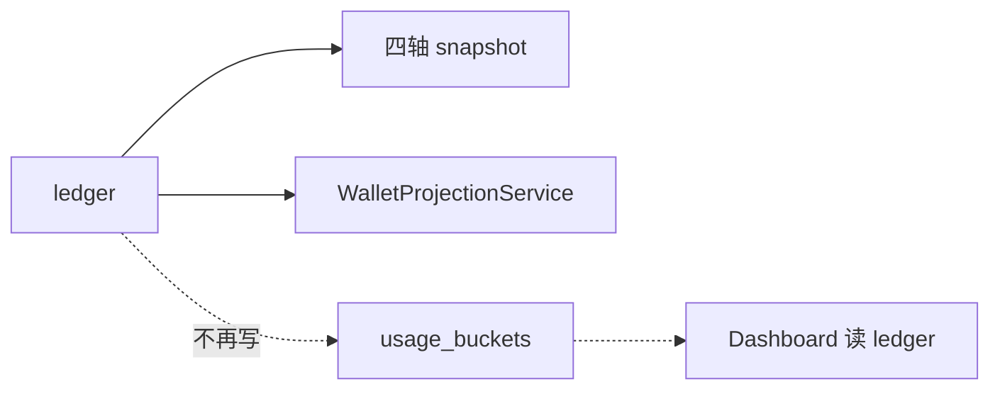

# Phase 2 详解：Schema 与 Ingest（`/v1` 零回退 + PRD 挡单不变）

> **定位**：Phase 2 整理表边界、收口钱包写、解耦看板；**不改 PRD 挡单语义**。  
> **硬约束 ①**：**`/v1` 预检效率不得回退**（§1.1）。  
> **硬约束 ②**：**`/v1` 仍按 member 个人 cap / budget_group cap 挡单**（四轴 snapshot，§5）。  
> **软约束**：Dashboard **允许变慢**。  
> **关联**：[架构简化方案.md](./架构简化方案.md) · [PRD.md](./PRD.md)

---

## 1. 约束分层

```mermaid
flowchart TB
  subgraph hard [硬约束 — 违反即失败]
    V1P[/v1 延迟 ≤ 基线]
    V1F[/v1 挡单语义 = PRD<br/>含 member + budget_group cap]
  end
  subgraph soft [软约束 — 允许]
    DASH[Dashboard 变慢]
  end
```

### 1.1 `/v1` 性能（不得回退）

| 指标 | 要求 |
| --- | --- |
| Postgres round-trip | **≤ 1**（`LoadPrecheckContext`） |
| 外部 HTTP 预检 | **0** |
| 钱包 | **O(1)** 读 `wallet_remain` |
| 预算 consumed | **读 snapshot 投影**；禁止 `/v1` 上 `SUM(ledger)` / `SUM(lot)` |
| `Evaluate()` | 纯内存 |
| P99 | **≤ Phase 2 前基线** |

### 1.2 `/v1` 功能（PRD，不得削弱）

Gateway 预检 remain 仍为 **四轴取 min**（与现网 Phase 1 一致）：

```text
remain = min(
  wallet_remain,
  dept_remain,           ← org_node snapshot + org_node_budget
  key_remain,            ← platform_key snapshot
  member_remain,         ← member snapshot + personal_budget（非挂组 Key）
  budget_group_remain    ← budget_group snapshot（挂组 Key）
)
```

| 挡单维度 | Phase 2 |
| --- | --- |
| 企业钱包 | ✅ 不变 |
| 部门预算 | ✅ 不变 |
| PlatformKey 预算 | ✅ 不变 |
| **成员个人 cap** | ✅ **必须保留** |
| **预算组 cap** | ✅ **必须保留** |
| 模型 allowlist | ✅ 不变 |

> **禁止**为减 JOIN 或减 Ingest 写入而拿掉 member/group 轴——那是 **PRD 功能回退**，不是性能优化。

### 1.3 Dashboard（允许变慢）

看板可改扫 `usage_ledger`、异步 MV 等；**不设 P99 门槛**。

### 1.4 验收

| 场景 | 通过标准 |
| --- | --- |
| **`/v1` P99** | ≤ 基线 |
| **member / group 挡单** | 单测 + gateway 集成测与 Phase 1 **一致** |
| Dashboard | 功能正确即可 |
| `pnpm verify` | 绿 |

---

## 2. Phase 2 范围

```mermaid
flowchart TB
  subgraph in [Phase 2 做]
    E[拆 org_nodes]
    A[wallet_remain rename]
    B[WalletProjectionService]
    D[停写 usage_buckets]
  end

  subgraph keep [Phase 2 必须保持]
    S4[四轴 snapshot<br/>Ingest 写 + /v1 读]
    EV[Evaluate 四轴 min]
  end

  subgraph out [Phase 2 不做]
    X[四轴→两轴]
    Y[/v1 扫 ledger]
    Z[删 wallet_remain]
  end

  E --> GW[LoadPrecheckContext]
  S4 --> GW
  S4 --> EV
```

| # | 变更 | `/v1` 性能 | PRD 挡单 |
| --- | --- | --- | --- |
| **E** 拆 org | JOIN `org_node_budget` | bench ≤ 基线 | ✅ |
| **A** rename 投影列 | 无影响 | ✅ |
| **B** 钱包写收口 | 无影响 | ✅ |
| **D** 停写 buckets | **无**（`/v1` 不读 buckets） | ✅ |
| **四轴 snapshot** | **维持**四 JOIN | ✅ **必须** |
| ~~两轴~~ | ~~少 JOIN~~ | ~~更快~~ | ❌ **违反 PRD** |

---

## 3. 变更 E：拆 `org_nodes`

组织树 / 部门预算 / 路由分表（`org_nodes` + `org_node_budget` + `model_allowlist`）。

**`/v1`：** 仍在 **一次** `LoadPrecheckContext` 内 JOIN `org_node_budget` 取 `dept_budget` / `reserved_pool`；**四轴 snapshot JOIN 全部保留**。

**写路径：** org sync 不再 `SetTree` 覆盖 budget；财务改预算只 UPDATE `org_node_budget`。

---

## 4. 变更 A / B：钱包

- `balance_point` → `wallet_remain`（rename，O(1) 读不变）
- `WalletProjectionService` 唯一写 lot + 投影

---

## 5. 四轴 snapshot：**Phase 2 完整保留**

### 5.1 表与读写（与 Phase 1 相同）

| axis_kind | Ingest 写 | `/v1` 读 | Evaluate |
| --- | --- | --- | --- |
| `platform_key` | ✅ | ✅ | ✅ |
| `org_node` | ✅ rollup | ✅ | ✅ |
| `member` | ✅ | ✅ | ✅ **个人 cap 挡单** |
| `budget_group` | ✅（挂组） | ✅ | ✅ **组 cap 挡单** |

`LoadPrecheckContext` **保留**（示意）：

```sql
LEFT JOIN budget_snapshots key_snap    ... platform_key
LEFT JOIN budget_snapshots dept_snap   ... org_node
LEFT JOIN budget_snapshots member_snap ... member      -- 保留
LEFT JOIN budget_snapshots bg_snap       ... budget_group  -- 保留
```

`Evaluate` / `checkBudgetRemain`：**不删** `memberAxis`、`groups` 分支（见 `evaluate.go`）。

### 5.2 为何不能改成「两轴」

| 方案 | `/v1` 性能 | PRD |
| --- | --- | --- |
| 两轴 + 不挡 member/group | 略快 | ❌ 功能缺失 |
| 两轴 + 预检扫 ledger 算 member consumed | ❌ 变慢 | ✅ |
| **四轴 snapshot（选定）** | bench 守门 | ✅ |

**结论：member / budget_group 的 consumed 必须继续由 Ingest 写 snapshot 维护，供 `/v1` O(1) 投影读取。**

### 5.3 例子：个人 cap 用尽

Alice 个人 cap 5000，已 consumed 4990；Key 预算仍剩 800；部门仍剩 3000。

```text
member_remain  = 5000 - 4990 = 10  → min 之一
/v1 再请求     → remain < minEstimate → 403 budget exceeded  ✅ PRD
```

若停写 member snapshot → consumed 不涨 → **挡单失效**（PRD  bug）。

---

## 6. 变更 D：停写 `usage_buckets`（唯一可减负的 Ingest 写）

### 6.1 改什么

- Ingest **删除** `projection.Apply` 里的 `UpsertBucket`
- Dashboard 改为 `usage_ledger` 聚合（**可慢**）

### 6.2 为何安全

| 消费者 | 读 buckets？ | Phase 2 |
| --- | --- | --- |
| **`/v1` Gateway** | **否** | 无影响 |
| **Evaluate / snapshot** | **否** | 无影响 |
| **Dashboard** | 是 → 改 ledger | 允许慢 |

**四轴 snapshot 写入量与 Phase 1 相同**；仅去掉 buckets 一行 upsert。

---

## 7. Ingest 写路径（Phase 2 后）

```text
1. enforceBudgetCap（四轴 remain，与 Gateway 一致）
2. INSERT usage_ledger
3. IncrementConsumed(platform_key)
4. IncrementConsumed(budget_group)   -- 若有，保留
5. IncrementConsumed(member)           -- 若有，保留
6. RollupOrgNodeAncestors(org_node)
7. WalletProjectionService.Consume
（无 usage_buckets）
```



---

## 8. 端到端对比

| 项 | Phase 1 | Phase 2 |
| --- | --- | --- |
| `/v1` store 调用 | 1 | **1** |
| 四轴 JOIN + Evaluate | ✅ | **✅ 不变** |
| member/group 挡单 | ✅ | **✅ 不变** |
| Ingest snapshot 写 | 四轴 | **四轴** |
| Ingest buckets 写 | ✅ | **停写** |
| org 预算来源 | `org_nodes.budget` | `org_node_budget` |
| 钱包写 | 分散 | **WalletProjectionService** |

---

## 9. 实施顺序

```text
1. 拆 org_nodes + org_node_budget
2. Gateway SQL（org_node_budget + 四轴 snapshot 全保留）+ /v1 bench
3. 确认 member/group 挡单测例绿
4. 停写 usage_buckets + Dashboard 改 ledger
5. wallet_remain + WalletProjectionService
6. pnpm verify
```

---

## 10. 代码落点

| 文件 | 动作 |
| --- | --- |
| `gateway_precheck_repo.go` | JOIN `org_node_budget`；**保留四轴 snapshot** |
| `evaluate.go` | **不改动四轴 min 逻辑** |
| `projection.go` | **保留四轴**；**删 UpsertBucket** |
| `budget_guard.go` | 与 Gateway 一致（四轴） |
| Dashboard | ledger 聚合 |
| 钱包 / org | 同前 |

---

## 11. 验收清单

| # | 项 |
| --- | --- |
| 1 | `/v1` P99 ≤ 基线；≤1 store；0 NewAPI HTTP |
| 2 | **member 个人 cap 超限时 403**（gateway 测） |
| 3 | **budget_group cap 超限时 403**（gateway 测） |
| 4 | 四轴 snapshot Ingest **仍写** |
| 5 | `usage_buckets` Ingest **停写** |
| 6 | org / 钱包变更同前 |
| 7 | `pnpm verify` 绿 |

---

## 12. 三条底线（汇总）

1. **`/v1` 不能变慢** — bench 守门；不扫 ledger、不 SUM(lot)。  
2. **`/v1` 不能少挡单** — member + budget_group cap 与 PRD 一致；四轴 snapshot 读写保留。  
3. **Dashboard 可以慢** — 停写 buckets，看板改 ledger。

---

## 相关文档

- [架构简化方案.md](./架构简化方案.md) · [PRD.md](./PRD.md)
