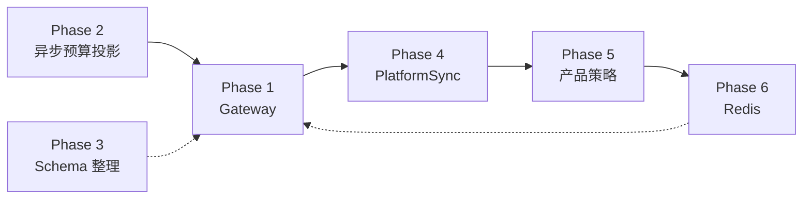
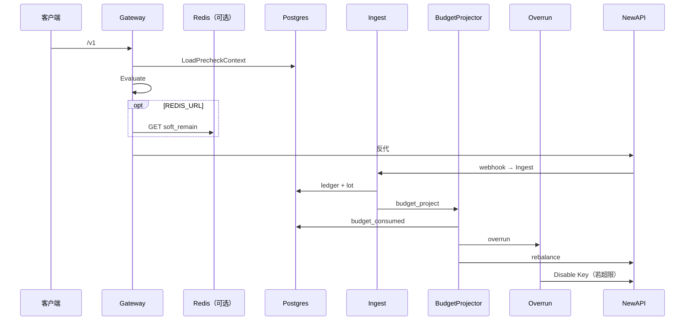

# 架构简化：分阶段详解

> **读法**：本文用图 + 例子解释各 Phase「干什么、为什么、做成什么样」。  
> **约束与验收**：[架构简化方案.md](./架构简化方案.md)  
> **预算投影专篇**：[实现-异步预算投影.md](./实现-异步预算投影.md)  
> **问题背景**：[架构评审-系统与数据模型.md](./架构评审-系统与数据模型.md)

---

## 总览



| Phase | 一句话 | 状态 | 主要路径 |
| --- | --- | --- | --- |
| **1 Gateway** | `/v1` = 1× SQL + 纯内存 + 0 预检 HTTP | ✅ | 每次 LLM 调用 |
| **2 异步预算投影** | ledger 单写；`budget_consumed` 异步；Overrun/Rebalance 后置 | ✅ | 入账 / 预算 / 看板 |
| **3 Schema 整理** | org 拆表、wallet rename、写收口 | ☐ | 维护成本 |
| **4 PlatformSync** | `wallet_sync` + `rebalance` 合并 debounce 管道 | ☐ | NewAPI 对齐 |
| **5 产品策略** | 部门 soft/hard，不增加预检 I/O | ☐ | 控制台 / 策略 |
| **6 Redis** | 可选缓存加速预检 | ⚠️ 软挡已落地 | 超高频 `/v1` |

**已交付：** Phase 1 + 2 + GatewayBudgetCheck（Phase 6 子集）  
**推荐后续：** Phase 3 → 4 → 5；极高 QPS 再扩 Phase 6 整包缓存

---

## 贯穿例子：Acme 一次完整调用

| 角色 | 值 |
| --- | --- |
| 企业 | Acme（`company_id=42`） |
| 部门 | 研发部，月预算 10_000 point |
| Key | `sk-acme-alice` |
| 钱包 | `companies.balance_point = 5_000` |
| 本月 consumed | 部门 3_000 / Key 800（`budget_consumed`；Gateway **不读**） |
| 请求 | `POST /v1/chat/completions`，`model=gpt-4o` |

**调用时序：**

1. **`/v1`**：钱包够 + Key active + 模型在白名单 → 放行（可选 Redis `soft_remain` 软挡；miss 放行）
2. **Ingest**：写 `usage_ledger` + lot 扣减；入队 `budget_project`、`wallet_sync`
3. **BudgetProjector（目标 lag ≤1s）**：更新 `budget_consumed` → 入队 `rebalance`、`overrun`
4. **Overrun**：四轴任一超限 → Disable Key

组织预算在 Gateway **不同步 403**；执法靠 Overrun + 可选 Redis 软挡。产品须确认 US-08「超卖窗口」语义（见 [实现-异步预算投影.md](./实现-异步预算投影.md) §1）。

---

## Phase 1 — Gateway — ✅

实现：[Backend-架构.md](./Backend-架构.md) §6 · [实现-异步预算投影.md](./实现-异步预算投影.md) §9

### 路径

```text
LoadPrecheckContext(key_hash)  →  Evaluate（纯内存）  →  可选 Redis GET  →  反代 NewAPI
        1× PG                         0 I/O               soft_remain
   pk ⋈ companies + allowlist                              miss → 放行
        0 预检 HTTP
```

### `PrecheckContext`

```text
PrecheckContext
├── WalletState   { company_status, balance_point, ... }
└── RoutingState  { key_status, has_allowlist, allowlist_types, platform_key_id }
```

组织预算、策略不在 Gateway 加载；`Evaluate` 不 JOIN `budget_consumed` / limit 配置表。

### `Evaluate` 检查项

```text
1. company active
2. balance_point >= minEstimate
3. key_status == active
4. allowlist（若启用）
5.（可选）GatewayBudgetCheck.soft_remain > 0
```

### 约束

- ≤1 store 调用；0 预检 HTTP
- 禁止 `/v1` 上 `SUM(lot)`、扫 ledger、读 NewAPI quota
- 保留：反代、`sk-xxx` 鉴权、`allowedGatewayPaths`
- `company.WalletService` 仅冷路径（billing / wallet_sync），不进 Gateway

### 验收

- NewAPI Admin 不可用时预检仍可通过
- `pnpm verify` 绿

---

## Phase 2 — 异步预算投影 — ✅

专篇：[实现-异步预算投影.md](./实现-异步预算投影.md)

### 模式

| 路径 | 职责 |
| --- | --- |
| **Ingest** | lot → ledger → `InsertTx(budget_project)` + `InsertTx(wallet_sync)` |
| **BudgetProjector** | `budget_consumed` +=；progress 推进；批末 `rebalance` + `overrun` |
| **BudgetReconcile** | `ExpectedConsumed` ↔ `budget_consumed`；漂移 `SetConsumed` |
| **DashboardProjector** | 异步写 `usage_buckets`（hour/day 读路径） |
| **DashboardReconcile** | buckets 与 ledger 窗口对账 |
| **Gateway** | 0 consumed JOIN；执法在 Overrun |

### 架构

```mermaid
flowchart TB
  ING[Ingest] --> UL[(usage_ledger)]
  ING --> LOT[lot / balance_point]
  ING --> BPQ[budget_project]
  ING --> WSQ[wallet_sync]

  BPQ --> BP[BudgetProjector]
  BP --> BC[(budget_consumed)]
  BP --> PRG[(budget_projection_progress)]
  BP --> RBQ[rebalance]
  BP --> ORQ[overrun]
  BP -.->|可选| GBC[(GatewayBudgetCheck)]

  SCH[River Periodic] --> BRF[budget_reconcile fanout]
  BRF --> REC[BudgetReconcile]
  REC --> BC

  SCH --> DPF[dashboard_project fanout]
  DPF --> DP[DashboardProjector]
  DP --> UB[(usage_buckets)]

  GW[/v1] --> PG[pk + companies + allowlist]
  GW -.-> GBC
  OV[Overrun] --> Disable[Disable Key]
  BC --> OV
  RB[Rebalance] --> NA[NewAPI remain_quota]
```

### Ingest 事务

```text
1. AcquireBudgetLock
2. Idempotency check
3. AllocateConsumptionLots → INSERT usage_ledger
4. InsertTx(budget_project)
5. InsertTx(wallet_sync)
```

Ingest **不写** `budget_consumed`、`usage_buckets`；**不入队** rebalance / overrun。

### Rebalance 时序

Rebalance 读 `budget_consumed` 算 `ComputeRemainBudget` → NewAPI `remain_quota`。  
**仅**在 BudgetProjector 批提交后、或 BudgetReconcile 修漂移后入队。

### 存储

| 表 | 用途 |
| --- | --- |
| `budget_consumed` | 四轴 consumed SSOT（投影，可对账重算） |
| `budget_projection_progress` | BudgetProjector 游标 |
| `dashboard_projection_progress` | DashboardProjector 游标 |
| `usage_buckets` | 看板 hour/day（Dashboard 异步写） |

### 代码落点

| 组件 | 路径 |
| --- | --- |
| 归因 | `domain/budget/consumed_attrib.go` |
| 投影 / 对账 | `domain/budget/budget_projector.go`、`budget_reconcile.go` |
| 看板 | `domain/dashboard/dashboard_*.go` |
| Workers | `infra/river/workers/budget_project.go`、`dashboard_project.go` |
| Periodic | `infra/river/periodic.go` |
| Gateway SQL | `store/postgres/gateway_precheck_repo.go` |

### 验收

| 项 | 状态 |
| --- | --- |
| 核心路径 + `pnpm verify` | ✅ |
| `budget_reconcile` / `dashboard_reconcile` 单测 | ☐ |
| Overrun platform_key 轴、挂组跳过 member 单测 | ☐ |
| Projector lag / `/v1` P99 bench | ☐ |
| PRD US-08 书面确认 | ☐ |
| 阈值通知 80%/90%（Projector 触发） | ☐ 单独估工时 |

---

## Phase 3 — Schema 整理 — ☐

与预算投影正交，可独立推进：

| 项 | 说明 |
| --- | --- |
| **E** | 拆 `org_nodes` → `org_node_budget`；财务改预算不碰组织树 |
| **A** | `balance_point` → `wallet_remain`（rename，O(1) 读不变） |
| **B** | `WalletProjectionService`：lot + 投影列唯一写入口 |

---

## Phase 4 — PlatformSync — ☐

合并 `wallet_sync` + `rebalance` 为 debounce 的 `PlatformSync(company_id)`：

```text
PlatformSync(company_id)
  1. 读 balance_point
  2. TopUp / 校准 NewAPI 企业 wallet
  3. 按策略刷新各 PlatformKey remain_quota
```

**当前 River kind（Phase 4 前）：**

- `wallet_sync`：Ingest / 充值 → NewAPI wallet
- `rebalance`：Projector / Reconcile / 充值 → Key quota

`newapi_sync` outbox 铁律不变。

---

## Phase 5 — 产品策略 — ☐

在 **不增加 Gateway store 调用** 前提下扩展挡单策略：

| `org_budget_mode` | 行为 |
| --- | --- |
| `hard` | 超预算 → 403（需定义：Gateway JOIN vs Overrun-only） |
| `soft` | 放行 + 告警 |
| `alert_only` | 仅记录 |

当前 Gateway 无 `PolicyState`；de facto soft 由 Overrun + 可选 Redis 软挡承担。落地前需定：**hard 是否接受恢复 budget JOIN**。

---

## Phase 6 — Redis — ⚠️

### 已落地：`GatewayBudgetCheck`

| 项 | 约定 |
| --- | --- |
| 配置 | `REDIS_URL` 空 → no-op |
| Key | `gateway:budget_check:{company_id}:{key_hash}` |
| Value | `{ periodKey, softRemain, keyStatus, updatedAt }` |
| 写 | BudgetProjector / BudgetReconcile（事务外） |
| 读 | Gateway +1 GET；**miss 降级放行，禁止回源 PG** |

详见 [实现-异步预算投影.md](./实现-异步预算投影.md) §10。

### 可选扩展：整包 `PrecheckContext` cache

极高 QPS 时可缓存完整预检上下文；miss 回源 Postgres。与 soft block **独立**，`REDIS_URL` 启用时二者可并存。

---

## 端到端时序



| 层 | 用户感知 | 系统 |
| --- | --- | --- |
| 预检 | 快 | 1× PG + Evaluate ± Redis |
| 入账 | 无感 | ledger 单写 |
| 预算 | 超卖窗口内可能仍 200 | Overrun Disable |
| 执行面 | NewAPI quota | Rebalance 异步对齐 |
| 看板 | hour/day 有投影 lag | Dashboard 异步 buckets |

---

## 优化 backlog

架构方向成立；上线前建议优先：

| 优先级 | 项 | 建议 |
| --- | --- | --- |
| **P0** | Overrun job 量 | Projector 批内逐条 ledger 入队 overrun → 改为 company 级或按 key dedupe |
| **P0** | 测试 | `budget_reconcile`、platform_key Overrun、挂组跳过 member |
| **P0** | 产品 | US-08 超卖窗口书面确认 |
| **P1** | 可观测 | Projector lag 指标；`/v1` P99 bench；Redis hit/miss |
| **P2** | 维护 | GatewayBudgetCheck 写 batch；Reconcile 窗口可配置；Phase 3–6 按需推进 |

**禁止：**

- `/v1` 热路径读 consumed / 扫 ledger
- Redis 当 SSOT；miss 回源 PG 算 remain
- Reconcile 用 `ApplyIncrement` 修漂移
- Ingest 入队 rebalance / overrun

---

## 实施顺序

| 场景 | 顺序 |
| --- | --- |
| 已交付 | Phase 1 → 2 → GatewayBudgetCheck |
| 上线加固 | P0 backlog |
| 下一迭代 | Phase 3 → 4 |
| 产品需要 | Phase 5 |
| 极高 QPS | Phase 6 整包 cache |

---

## 相关文档

| 文档 | 内容 |
| --- | --- |
| [实现-异步预算投影.md](./实现-异步预算投影.md) | 预算投影 schema、Worker、验收 |
| [架构简化方案.md](./架构简化方案.md) | 不变量与代码对照 |
| [Backend-离线任务.md](./Backend-离线任务.md) | River kind、Periodic |
| [Backend-架构.md](./Backend-架构.md) | Gateway 请求链 |
| [Backend-预算.md](./Backend-预算.md) | 四轴、Rebalance、Overrun |
