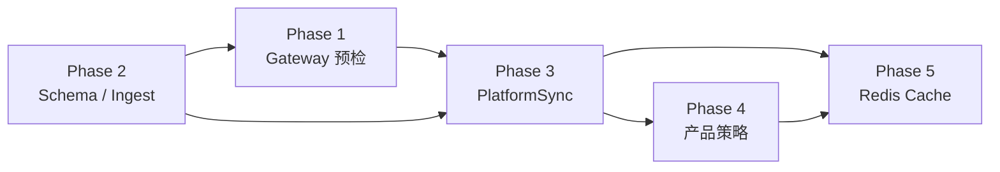
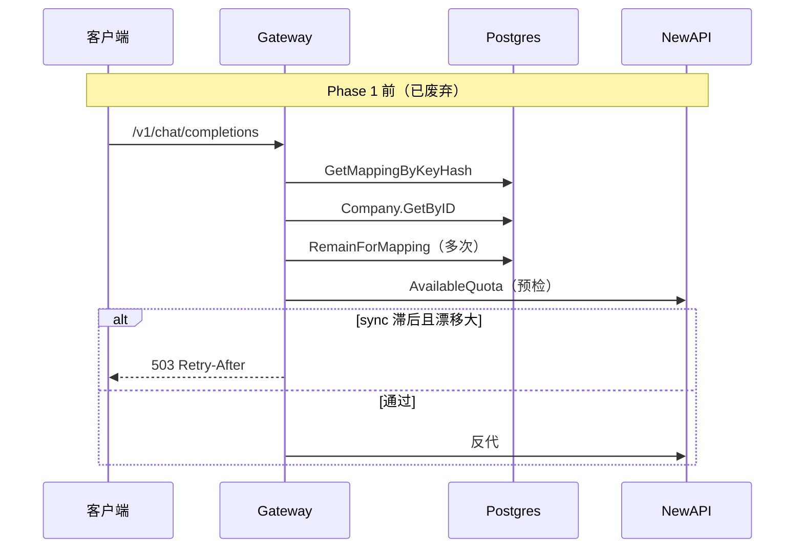
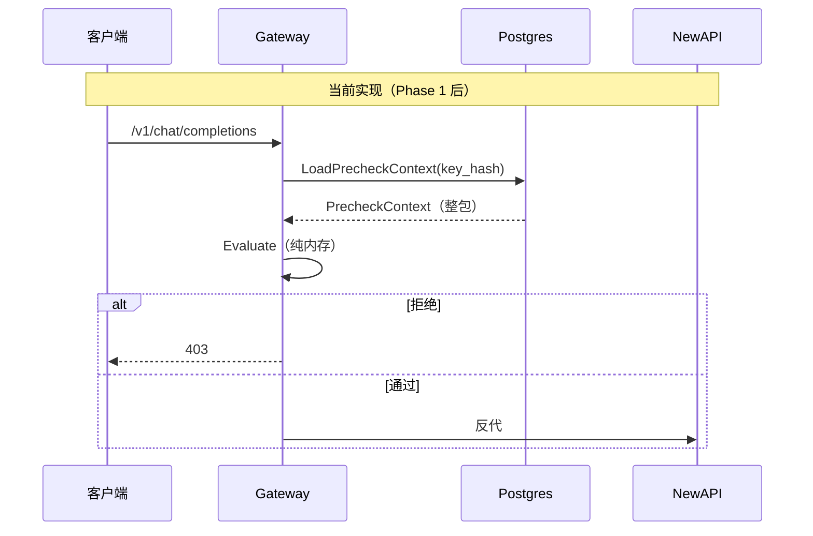
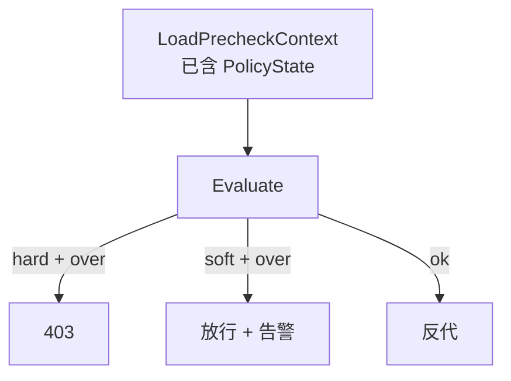
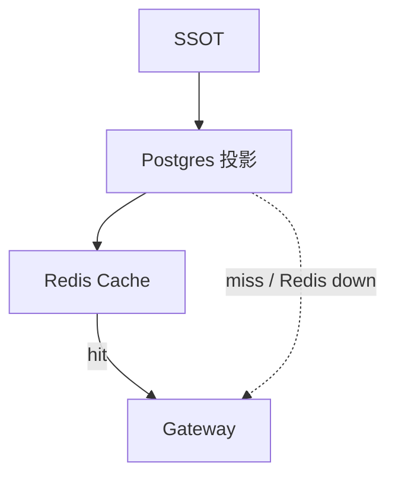
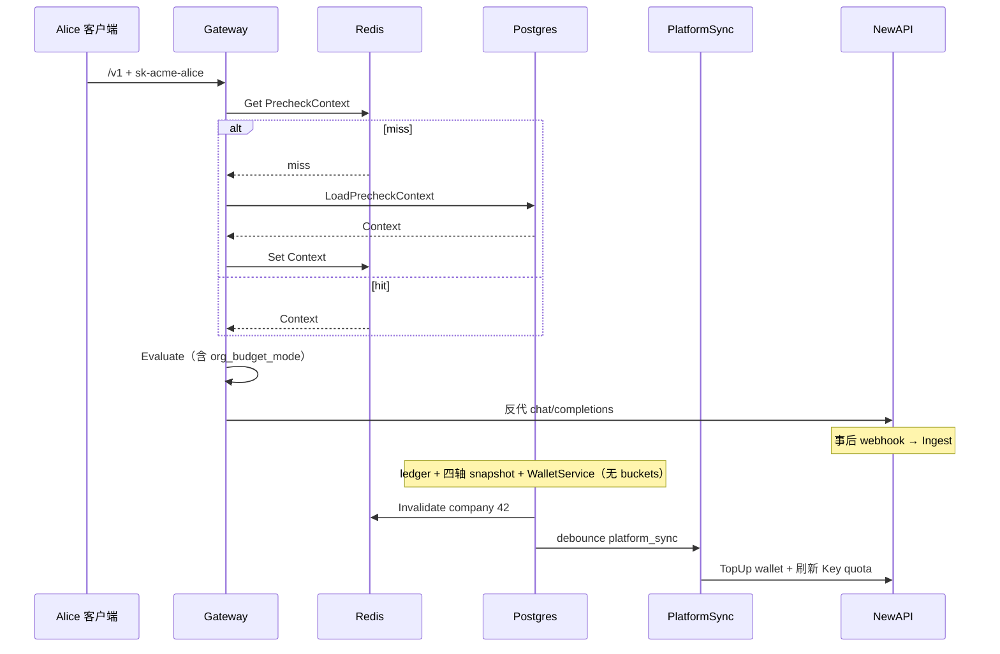

# 架构简化：分阶段详解

> **读法**：本文用图 + 例子解释每个 Phase「干什么、为什么、做成什么样」。  
> **权威蓝图**（约束、验收、代码对照）：[架构简化方案.md](./架构简化方案.md)  
> **问题背景**：[架构评审-系统与数据模型.md](./架构评审-系统与数据模型.md)

---

## 总览：五个 Phase 各解决什么



| Phase | 一句话 | 主要受益路径 | 必须？ |
| --- | --- | --- | --- |
| **1 Gateway** | `/v1` 预检变成「1 次 SQL + 纯内存判定」 | 每次 LLM 调用 | **必须** |
| **2 Schema** | Ingest 少写、表职责拆开、钱包写收口 | 入账 / 维护成本 | **必须** |
| **3 PlatformSync** | 把「推 NewAPI」收成一条异步管道 | 充值后一致性 | **必须** |
| **4 产品** | 部门超预算可 hard/soft，不增加预检 I/O | 控制台 / 策略 | 推荐 |
| **5 Redis** | 用缓存加速预检，挂了还能回 Postgres | 超高频 `/v1` | 受支持 |

**为什么按这个顺序？**

- Phase 2 先把表结构理顺，Phase 1 的 `LoadPrecheckContext` SQL 才写得干净。
- Phase 1 去掉热路径对 NewAPI 的依赖后，Phase 3 才能专心做「异步最终一致」，而不必再靠 Gateway 503 挡同步滞后。
- Phase 4 / 5 都建立在「整包 `PrecheckContext`」之上，所以排在后面。

---

## 贯穿例子：Acme 公司打一次 `/v1`

后面每个 Phase 都用同一家公司串起来：

| 角色 | 值 |
| --- | --- |
| 企业 | Acme（`company_id=42`） |
| 部门 | 研发部，月预算 10_000 point |
| Key | `sk-acme-alice`，映射到 Alice 的 PlatformKey |
| 企业钱包投影 | `balance_point = 5_000`（目标列名 `wallet_remain`） |
| 本月已消耗 | 部门 3_000 / Key 800 |
| 请求 | `POST /v1/chat/completions`，`model=gpt-4o` |

**业务期望：** 钱包够、部门预算够、Key 有效、模型在白名单 → 放行并反代 NewAPI。

---

## Phase 1 — Gateway：让 `/v1` 又快又稳 — **已实现（2026-07）**

实现引用：[Backend-架构.md](./Backend-架构.md) §6。

### 干什么

把 Gateway 预检从「多次查库 + 读 NewAPI」收成：

```text
LoadPrecheckContext(key_hash)  →  Evaluate(ctx, model)  →  反代 NewAPI
         1× SQL / CTE                 纯内存                 0 预检 HTTP
```

### 为什么要这么做（Phase 1 前的问题，已解决）

`/v1` 是最高频路径。Phase 1 **前**的主要问题：

1. **往返多**：mapping → company → 开账月 → remain → key → allowlist，Gateway 层多次散落 store 调用。
2. **热路径打 NewAPI**：`checkNewAPIWalletCap` / `checkWalletSyncLag` 会 HTTP 读 NewAPI quota；合法请求也可能 **503**。
3. **职责混**：预检既信 Postgres，又信 NewAPI 派生配额。

Phase 1 **后**：上述三项均已消除（见下图「当前实现」）。





### 例子：Alice 这次请求怎么判

Phase 1 一次拉回的上下文（示意）：

```text
PrecheckContext
├── WalletState
│     wallet_remain = 5000
│     company_status = active
├── BudgetState
│     dept_limit = 10000, dept_consumed = 3000   → remain 7000
│     key_limit  = 2000,  key_consumed  = 800    → remain 1200
├── PolicyState
│     blocked = false
│     org_budget_mode = hard   （Phase 4 才真正用）
└── RoutingState
      key_status = active
      allowlist = {gpt-4o, gpt-4o-mini}   （或「无白名单 = 全放」）
```

`Evaluate()` 伪代码：

```text
if company blocked                         → 403
if wallet_remain < minEstimate             → 403 insufficient wallet
if min(dept_remain, key_remain) < min      → 403 budget exceeded
if key inactive                            → 403
if model not in allowlist（有白名单时）     → 403
else                                       → OK → 反代
```

Alice 的请求：钱包 5000、部门剩 7000、Key 剩 1200、模型在白名单 → **放行**。

### 具体交付清单

| 做 | 说明 |
| --- | --- |
| 新建 `PrecheckContext` | 按 Wallet / Budget / Policy / Routing 分域，避免大杂烩结构体 |
| `LoadPrecheckContext` | store **一次**调用；内部可用单 SQL / CTE |
| `Evaluate` | 纯函数，无 I/O；Phase 4 只扩 Policy 分支 |
| 删除热路径 | `checkNewAPIWalletCap`、`checkWalletSyncLag`、对 `company.WalletService` 的依赖 |
| 保留 | 反代、`sk-xxx` 鉴权、`allowedGatewayPaths` |

### 不做 / 注意

- **不**在 `/v1` 做 `SUM(lot)` —— 继续读投影列。
- **不**删 `company.WalletService` —— Phase 3 冷路径还要用（它是 NewAPI HTTP 客户端，不是 lot 写服务）。
- Phase 2：**四轴 snapshot 保留**（PRD 挡单）；仅 bench **`/v1`**；Dashboard 可慢。

### 验收直觉

同一请求压测：P99 预检下降；断掉 NewAPI Admin 时，**预检仍可通过**（反代失败是另一回事）；不再因 wallet_sync 滞后返回 503。

---

## Phase 2 — Schema / Ingest（`/v1` 零回退 + PRD 挡单不变）

> **专篇**：[架构简化-Phase2详解.md](./架构简化-Phase2详解.md)

### 硬约束（两条）

1. **`/v1` 不能变慢** — ≤1 store、0 NewAPI、O(1) wallet、不扫 ledger。  
2. **`/v1` 不能少挡单** — **member 个人 cap + budget_group cap** 与 PRD 一致；**四轴 snapshot 读写保留**。

Dashboard **可以慢**（停写 `usage_buckets`，看板改 ledger）。

### Phase 2 做 / 不做

| 做 | 不做 |
| --- | --- |
| 拆 org、wallet rename、写收口 | **四轴→两轴** |
| **保留四轴** snapshot + Evaluate | `/v1` 扫 ledger 算 member consumed |
| 停写 buckets | 削弱 member/group 挡单 |

### 验收

`/v1` bench ≤ 基线 + **member/group 超限 403 测例绿**。

---

## Phase 3 — PlatformSync：Postgres → NewAPI 最终一致

### 干什么

把现在分散的 **`wallet_sync` + `rebalance` + 相关 worker** 收成一条异步管道：

```text
PlatformSync(company_id)
  1. 读 wallet_remain
  2. TopUp / 校准 NewAPI 企业 wallet
  3. 按策略更新各 PlatformKey 的 NewAPI remain_quota
```

### 为什么要这么做

Phase 1 之后，Gateway **不再**读 NewAPI 做预检。那 NewAPI 上的 quota 还有什么用？

→ 它是 **执行面投影**：真正反代到 NewAPI 时，上游仍用自己的配额拦请求。Postgres 是权威；NewAPI 必须被异步推齐。

现状：

```mermaid
flowchart TB
  RCH[充值确认] --> WS[enqueue wallet_sync]
  ING[Ingest] --> WS
  BUD[预算变更] --> RB[enqueue rebalance]
  WS --> W1[wallet_sync_processor]
  RB --> W2[rebalance_processor]
  W1 --> NA[NewAPI]
  W2 --> NA
  GW[/v1] -.->|现状还会查 sync lag| WS
```

问题：两条队列、两套语义、Gateway 还用 503「等同步」——职责纠缠。

目标：

```mermaid
flowchart LR
  EVT[充值 / Ingest / 预算变更] -->|debounce| PS[PlatformSync company_id]
  PS --> NA[NewAPI wallet + key quota]
  GW[/v1] -->|只信 Postgres 投影| PG[(wallet_remain + snapshots)]
```

### 例子：Acme 充值 10_000 point

| 步骤 | 谁做 | 结果 |
| --- | --- | --- |
| 1 | Billing 确认充值 | 新 lot + `wallet_remain += 10000`（写路径 WalletService） |
| 2 | 入队 | debounce 一条 `platform_sync`（company=42） |
| 3 | PlatformSync | `target = ToQuotaUnits(wallet_remain)` → NewAPI TopUp |
| 4 | PlatformSync | 按部门/Key 策略刷新各 Key `remain_quota` |
| 5 | 下次 `/v1` | 直接读新的 `wallet_remain`，**不等** NewAPI |

若 NewAPI 短暂失败：job 重试；**已确认的充值与 ledger 不回滚**（I5）。

### 与 Phase 1 的配合

| 能力 | Phase 1 前 | Phase 1+3 后 |
| --- | --- | --- |
| 预检信谁 | Postgres + NewAPI | **只信 Postgres** |
| sync 滞后 | Gateway 可能 503 | PlatformSync 冷消化 |
| NewAPI 用途 | 预检 + 执行 | **仅执行面**（反代时） |

### 具体交付清单

| 项 | 内容 |
| --- | --- |
| 合并 | `wallet_sync` + `rebalance` → `PlatformSync(company_id)` |
| 触发 | 充值、Ingest、预算变更后 debounce |
| outbox | PlatformKey 生命周期继续走 `newapisync` 铁律 |
| 保留 | `company.WalletService` **仅** PlatformSync / 对账使用 |

### 验收直觉

充值后短时间内 NewAPI wallet / Key quota 追上 `wallet_remain`；Gateway 压测不再出现 sync lag 503。

---

## Phase 4 — 产品策略：不牺牲 `/v1` 的扩展

### 干什么

在 `Evaluate()` 的 `PolicyState` 上增加部门预算模式，**不增加 store 调用**：

| `org_budget_mode` | 行为 | 适用 |
| --- | --- | --- |
| `hard`（默认） | 超部门 snapshot → **403** | 严格控费 |
| `soft` | 放行 + 告警 / 记 overrun | 研发冲刺月 |
| `alert_only` | 仅记录，不挡单 | 观察期 |

另：预算控制台统一用 point；可选把 `reserved_pool` 抽到 `budget_allocations`。

### 为什么要这么做

产品要「有的部门硬卡、有的部门软提醒」，但这必须落在 **已加载的 Context** 上，否则又会毁掉 Phase 1 的「≤1 store 调用」。



### 例子：研发部 soft、财务部 hard

同一时刻 `dept_remain = -50`（已超）：

| 部门 | mode | Alice 再调 `/v1` |
| --- | --- | --- |
| 财务 | `hard` | 403 budget exceeded |
| 研发 | `soft` | **200 反代**，后台告警 + overrun 记录 |

`org_budget_mode` 随 `PrecheckContext` 一次查出；`Evaluate` 只多一个 `switch`。

### 与现有 OverrunPolicy 的关系

现状已有 `budget.OverrunPolicy`（超限告警配置），**没有** Gateway 级 `org_budget_mode`。Phase 4 是产品语义升级，不是简单改名；落地时要明确：告警配置 vs 挡单策略，避免两套规则打架。

### 验收直觉

切换 mode 后，下一请求行为立刻符合表意；Gateway store 调用次数仍为 1。

---

## Phase 5 — Redis：Runtime Cache，不是第二套账本

### 干什么

在 Phase 1–4 落地后，用 Redis 缓存**整包**预检上下文，降低 Postgres 读放大：

| 对象 | key 示意 | 失效时机 |
| --- | --- | --- |
| `PrecheckContext` | `pc:{company_id}` | 充值 / Ingest / Budget / Block / Allowlist / PlatformKey |
| `PlatformKeyMapping` | `map:{key_hash}` | Key 创建 / 轮换 / 吊销 |

### 为什么要这么做

Phase 1 已经把预检收到 1 次 SQL——对多数规模够用。若单 key QPS 极高，Postgres 仍会成为瓶颈。Redis 的定位是：

```text
SSOT（ledger / lot）
  → Postgres 投影（wallet_remain / snapshots）
    → Redis Runtime Cache（可丢）
      → Gateway
```

**不是**把余额搬进 Redis 当账本。



### 例子：充值后的失效

1. Acme 充值成功 → 写路径 WalletService 提交 `wallet_remain=15000`
2. **同一路径同步** `InvalidatePrecheckContext(42)`（不能只靠 TTL）
3. Alice 下一请求：cache miss → 回源 Postgres → 读到 15000 → 再写入 Redis
4. 若 Redis 宕机：静默回源 Postgres，**绝不**因 Redis 挂而 403/503 合法请求

### Backend 支持要点

| 项 | 说明 |
| --- | --- |
| 配置 | `REDIS_URL` 空 = 禁用（行为同 Phase 4）；非空 = 启用 |
| 抽象 | `PrecheckCache` 接口 + Redis / no-op 两实现 |
| TTL | 仅兜底（如 300s）；主路径靠事件失效 |
| 指标 | hit / miss / fallback |

### 不做

- Redis 存余额 SSOT
- 删掉 `wallet_remain` 改读 Redis
- 按 wallet/budget/allowlist **拆多 key**（拼装易不一致）
- 只靠 TTL 保证「充值后立刻可见」

### 验收直觉

压测 P99 再降一截；杀 Redis 进程后 Gateway 仍可用；充值后下一次请求余额正确。

---

## 五个 Phase 合在一起：Alice 的完整路径



| 层 | Alice 感知 | 系统内部 |
| --- | --- | --- |
| 预检 | 快、稳、少 503 | Context + Evaluate（± Redis） |
| 入账 | 无感 | 少写、写收口 |
| NewAPI | 能调通即可 | PlatformSync 异步对齐 |
| 策略 | 部门 soft/hard | PolicyState，无额外 I/O |

---

## 实施顺序建议

| 场景 | 顺序 |
| --- | --- |
| **单人** | Phase 2 → Phase 1 → Phase 3 →（4）→（5） |
| **多人** | Phase 1 ∥ Phase 2，Gateway 优先合入 → Phase 3 → 4/5 |

**必须上线：** 1 + 2 + 3  
**推荐：** +4（默认 `hard`）  
**受支持：** +5（`REDIS_URL` 启用）

**整条链路不要做的事：**

- `/v1` 热路径 `SUM(lot)`
- 删掉 `wallet_remain` 投影列
- 热路径读 NewAPI 做预检
- Redis 当 SSOT
- migration / 兼容存量（项目未上线，wipe 即可）
- 拆微服务

---

## 相关文档

- [架构简化方案.md](./架构简化方案.md) — 约束、验收、与代码对照
- [架构评审-系统与数据模型.md](./架构评审-系统与数据模型.md) — 问题与行业对照
- [Backend-计费模式.md](./Backend-计费模式.md) · [Backend-预算.md](./Backend-预算.md) · [Backend-Ingest架构.md](./Backend-Ingest架构.md)
