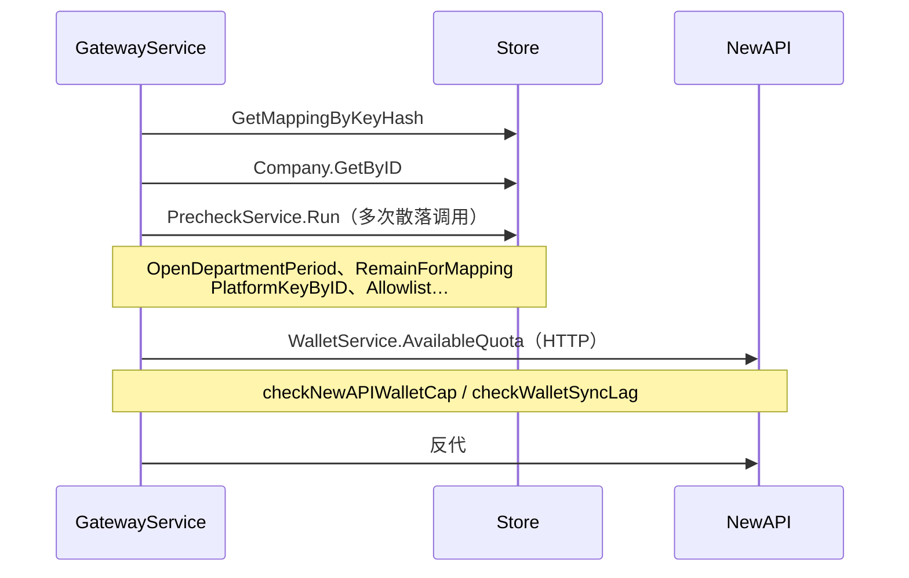
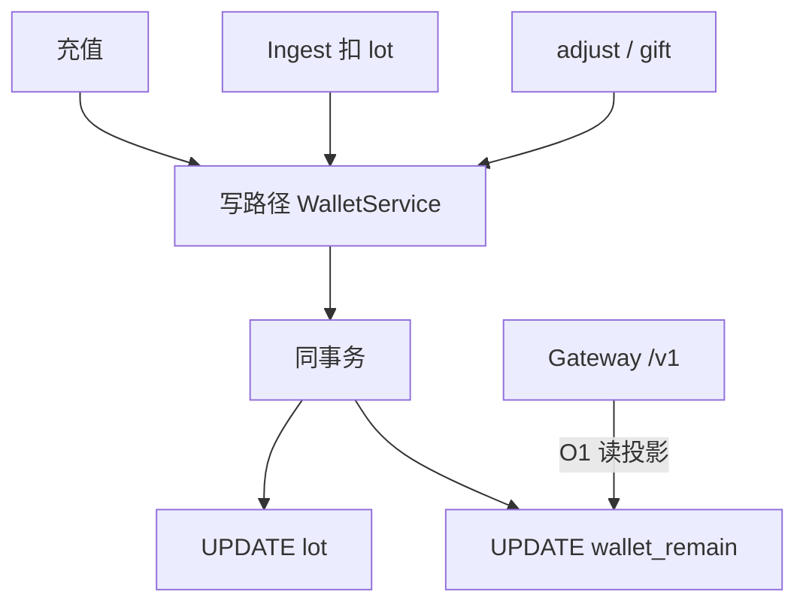
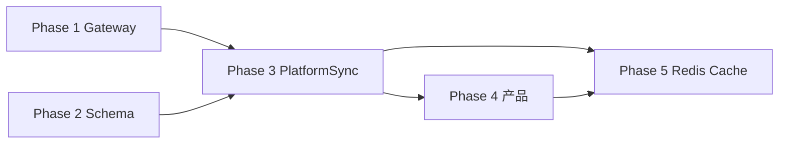
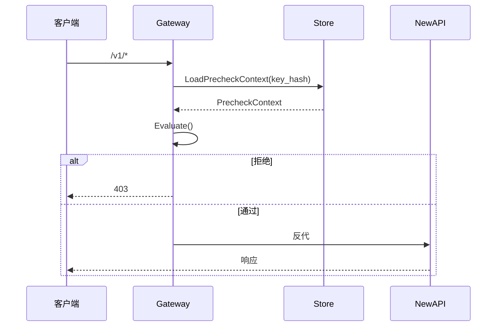
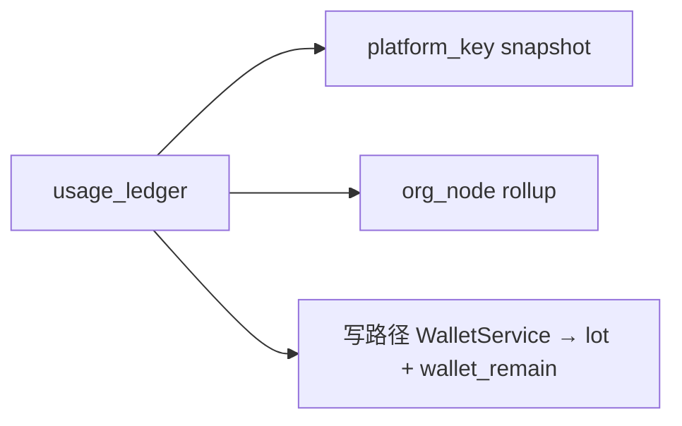
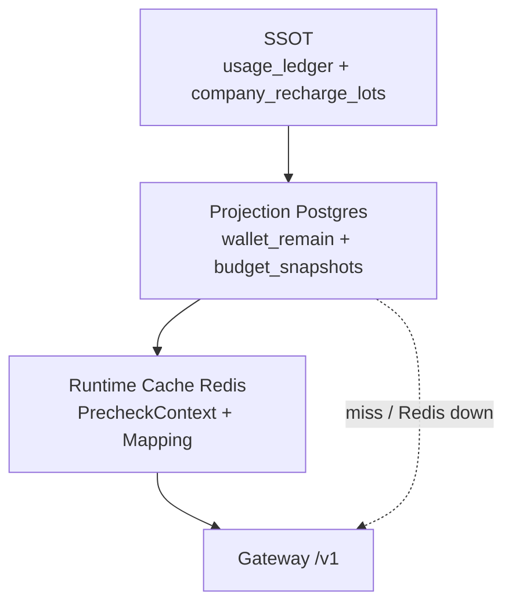

# 架构简化方案

> **范围**：未上线；改 `schema.sql` + wipe，无 migration、无存量客户。  
> **硬约束**：`/v1` 为最高频路径，**预检不得变慢**（§1）。  
> **关联**：[架构评审-系统与数据模型.md](./架构评审-系统与数据模型.md) · [Backend-计费模式.md](./Backend-计费模式.md) · [架构简化-分阶段详解.md](./架构简化-分阶段详解.md)（图解 + 例子）  
> **说明**：本文描述**目标架构**与分阶段交付；§0 对照当前代码，避免与实现脱节。

---

## 0. 现状与代码对照

### 0.1 后端包结构（当前）

| 包 / 路径 | 职责 | 简化方案中的位置 |
| --- | --- | --- |
| `domain/gateway/` | `/v1` 路由、反代、预检 | Phase 1 重构 |
| `domain/usage/` | Ingest、ledger、projection、lot 扣减 | Phase 2 Ingest 写路径 |
| `domain/billing/` | 充值、lot、`wallet_sync` | Phase 2 写收口 + Phase 3 |
| `domain/budget/` | 预算树、snapshot、rebalance | Phase 2 snapshot 轴 + Phase 3 |
| `domain/company/` | 租户上下文、`WalletService`（**读 NewAPI 配额**） | Phase 1 删除热路径依赖；Phase 3 保留冷路径 |
| `domain/newapisync/` | PlatformKey 生命周期 + outbox | Phase 3 outbox 铁律 |
| `domain/adminport/` + `integration/newapi/` | NewAPI Admin 适配 | 不变 |
| `infra/worker/` | ingest / wallet_sync / rebalance / outbox / overrun | Phase 3 合并为 PlatformSync |
| `store/postgres/` | Repository + `schema.sql` | Phase 2 schema |
| `pkg/budget/` | `RemainForMapping`、开账月 | Phase 1 迁入 `Evaluate` |

> **Redis**：代码中**尚未存在**；Phase 5 新增 `PrecheckCache` 抽象与 `REDIS_URL` 配置。

### 0.2 `/v1` 热路径：现状 vs 目标

**现状**（`gateway_service.go` + `precheck.go`）：



| 指标 | 现状 | 目标（§1） |
| --- | --- | --- |
| Gateway 层 store 调用 | **≥ 3**（mapping + company + precheck 内多次） | **≤ 1**（`LoadPrecheckContext`） |
| 外部 HTTP 预检 | **有**（`company.WalletService` → NewAPI quota） | **0** |
| 钱包余额读法 | `companies.balance_point`（O(1)） | 同列 rename → `wallet_remain` |
| 预检对象 | `PrecheckInput{Mapping, Company, Model}` | `PrecheckContext` 四域结构 |

**目标**：mapping + company + snapshot + allowlist 合并为一次 `LoadPrecheckContext(key_hash)`；`Evaluate()` 纯内存。

### 0.3 命名与职责：现状 vs 目标

| 概念 | 现状（代码 / schema） | 目标（本文） |
| --- | --- | --- |
| 钱包投影列 | `companies.balance_point` | rename → `wallet_remain`（语义不变） |
| `company.WalletService` | NewAPI 配额读取 + **进程内 TTL cache** | **仅** PlatformSync / 对账冷路径；Gateway **不再注入** |
| lot + 投影写 | 分散：`usage/lot_allocate.go` → `Billing().UpdateLotRemaining` + `Company().UpdateWalletPoint`；充值在 `billing_repo` | 收口 **`WalletProjectionService`**（新域服务；本文简称写路径 WalletService） |
| 预检服务 | `PrecheckService`（7 步检查） | `LoadPrecheckContext` + `Evaluate()` |
| 异步同步 | `async_jobs` 三通道：`wallet_sync`、`rebalance`、`newapi_sync` outbox | 合并 **`PlatformSync(company_id)`** |
| 预算 snapshot 轴 | 四轴：`org_node` / `budget_group` / `platform_key` / `member` | 两轴热路径：`org_node` + `platform_key` |
| `org_nodes` | 结构 + `budget` / `reserved_pool` + 路由字段同表 | 拆 `org_node_budget`；路由 → `model_allowlist` |
| `usage_buckets` | Ingest 仍写（`usage/projection.go`） | 删表或改 MV；Ingest 停写 |
| 部门预算策略 | `budget.OverrunPolicy`（超限告警） | Phase 4 新增 `org_budget_mode`（hard/soft/alert_only） |

### 0.4 各 Phase 与代码落点

| Phase | 主要改动文件（示意） |
| --- | --- |
| **1 Gateway** | `domain/gateway/gateway_service.go`、`precheck.go` → 新 `precheck_context.go`；`store/postgres/` 新增 `LoadPrecheckContext` |
| **2 Schema** | `schema.sql`；`usage/projection.go`、`lot_allocate.go`；`billing_repo.go` 写收口 |
| **3 PlatformSync** | 合并 `billing/wallet_sync.go` + `budget/rebalance.go` + `infra/worker/*_processor.go` → `domain/platformsync/` |
| **4 产品** | `domain/gateway/evaluate.go` 扩 `PolicyState`；`org_nodes` 或策略表加 `org_budget_mode` |
| **5 Redis** | 新 `infra/cache/` 或 `store/cache/`；`config` 加 `REDIS_URL`；Gateway / 写入口注入 `PrecheckCache` |

---

## 1. 架构原则（P0）

### 1.1 `/v1` 性能

| 指标 | 要求 |
| --- | --- |
| Postgres round-trip | **≤ 1** |
| Gateway 层 store 调用 | **≤ 1**（`LoadPrecheckContext` 一次 Repository 调用） |
| 外部 HTTP | **0**（不读 NewAPI 做预检） |
| 钱包余额 | **O(1)** 读 `wallet_remain` 投影列 |
| 判定 | `Evaluate()` 纯内存，无 I/O |

Repository 内部可用一条 SQL、CTE 等实现；**禁止** Gateway 层多次散落调用。  
**禁止出现在 `/v1`：** `SUM(lot)`、NewAPI quota 读取、wallet_sync 滞后 503。


### 1.2 不变量

| # | 不变量 |
| --- | --- |
| I1 | `usage_ledger` 仅追加，不改历史 |
| I2 | `company_recharge_lots` 是钱包事实来源 |
| I3 | `wallet_remain`（现 `balance_point`）**只能**由写路径 WalletService 在 lot 变更同事务中更新 |
| I4 | Gateway **不**读 NewAPI 做预检 |
| I5 | PlatformSync **仅**异步；投影错误不影响已提交 ledger |
| I6 | 投影可 TRUNCATE 后从事实重算 |
| I7 | 热路径 **不得** `SUM(lot)` |

### 1.3 热路径 vs 冷路径

| 路径 | 职责 |
| --- | --- |
| **热** `/v1` | 读 `wallet_remain` + `budget_snapshots` + allowlist |
| **热** Ingest | 写 ledger、snapshot、lot；经 **写路径 WalletService** 更新 `wallet_remain` |
| **冷** 看板 / 对账 / PlatformSync | ledger 聚合、`SUM(lot)` 校验、推 NewAPI quota |

---

## 2. 目标架构

### 2.1 SSOT → 投影 → 消费者

```mermaid
flowchart TB
  subgraph ssot [SSOT 事实]
    UL[usage_ledger]
    LOT[company_recharge_lots]
  end

  subgraph proj [物化投影 · Postgres]
    WR[wallet_remain]
    BS[budget_snapshots]
  end

  subgraph cache [Runtime Cache · Redis]
    RC[PrecheckContext + Mapping]
  end

  subgraph consumers [消费者]
    GW[/v1 Gateway]
    DASH[看板 / 审计]
    PS[PlatformSync]
  end

  UL --> BS
  LOT -->|写路径 WalletService 写穿| WR
  WR --> RC
  BS --> RC
  RC --> GW
  WR -. miss / Redis down .-> GW
  BS -. miss / Redis down .-> GW
  UL --> DASH
  BS --> DASH
  WR --> PS
  PS --> NA[NewAPI 执行面]
  GW --> NA
```

| 层 | 对象 | 说明 |
| --- | --- | --- |
| **事实（SSOT）** | ledger、lot | 审计与重算依据 |
| **投影** | `wallet_remain`、`budget_snapshots` | Postgres 物化投影；可重建 |
| **Runtime Cache** | `PrecheckContext`、`PlatformKeyMapping` | Redis 运行时缓存；可全删、miss 回源，**非 SSOT** |
| **异步** | PlatformSync | Postgres 与 NewAPI 的**最终一致**组件 |

> 三层严格单向依赖：**SSOT → Postgres 投影 → Redis 缓存 → Gateway**。Redis 只加速，正确性永远由下层保证。

### 2.2 钱包投影 `wallet_remain`

- **事实**：`company_recharge_lots`
- **投影**：`companies.wallet_remain`（**现状列名** `balance_point`；Phase 2 rename，语义统一称 wallet_remain）
- **读**：`/v1` O(1) 读投影列（现状已满足，见 `precheck.checkBalancePoint`）
- **写**：**仅写路径 WalletService** — 充值 / Ingest 扣 lot / adjust 在**同一事务**内更新 lot + 投影列
  - **现状**：写分散在 `usage/lot_allocate.go`（`UpdateLotRemaining` + `UpdateWalletPoint`）与 `billing_repo`（充值）；**未收口**
  - **目标**：新建 `WalletProjectionService`（或扩 `domain/billing`），禁止其它路径直接 `UPDATE balance_point`
- **禁止**：Repository 或其它业务代码直接 `UPDATE wallet_remain` / `balance_point`
- **对账**（冷路径）：PlatformSync 或单测用 `SUM(lot)` 校验投影

> **勿混淆**：现有 `domain/company.WalletService` 是 **NewAPI 配额 HTTP 客户端**（含进程内 cache），不是 lot 写服务。简化后它**退出 Gateway 热路径**，仅 PlatformSync / 对账使用。



### 2.3 其它纪律

| # | 内容 |
| --- | --- |
| 1 | PlatformKey 变更统一 outbox / Remote-first |
| 2 | 开账月 / 发生月强类型 |
| 3 | 预算 API 用 point；`display_amount` 仅财务 |
| 4 | point ↔ NewAPI unit 只经 `pkg/newapiunits` |

---

## 3. 实施阶段



> Phase 5 依赖 Phase 1 的整包 `PrecheckContext`（缓存对象）与 Phase 4 的 `PolicyState`（可一并缓存），故排在最后落地。

| 协作方式 | 建议顺序 |
| --- | --- |
| **多人** | Phase 1 与 Phase 2 **并行**；Gateway 改动优先合入 |
| **单人** | **先 Phase 2 Schema**，再 Phase 1 Gateway（Context SQL 依赖表结构） |

---

### Phase 1 — Gateway（`/v1`）

**目的：** 预检 = 1 次 Repository 调用 + `Evaluate()` + 反代。

**现状差距：**

| 项 | 现状 | 目标 |
| --- | --- | --- |
| 入口 | `GatewayService.ServeHTTP` 先调 mapping + company，再 `PrecheckService.Run` | 合并为 `LoadPrecheckContext(key_hash)` |
| 预检 | 7 步：`checkBalancePoint`、`checkBudgetRemain`（多 store）、`checkNewAPIKeyRemainQuota`、`checkNewAPIWalletCap`（**HTTP**）、`checkWalletSyncLag`（**HTTP + 503**）、`checkPlatformKey` | `Evaluate(PrecheckContext)` 纯内存 |
| NewAPI 字段 | `PlatformKeyMapping.NewAPIKeyRemainQuota` 参与预检 | 删除热路径依赖；quota 仅 PlatformSync 维护 |
| 预算 remain | `pkg/budget.RemainForMapping` 多次 snapshot / org 查询 | 预检 SQL 一次带出 consumed + limit |



**`PrecheckContext` 结构（目标；现状不存在，由 Phase 1 新建）：**

```text
PrecheckContext
├── WalletState      # wallet_remain, company_status
├── BudgetState      # key/dept consumed & limit
├── PolicyState      # blocked, org_budget_mode（Phase 4）
└── RoutingState     # allowlist / model 是否允许
```

**交付：**

| 项 | 内容 |
| --- | --- |
| `LoadPrecheckContext` | store **一次**调用；内部单 SQL/CTE：mapping + `wallet_remain` + snapshot + allowlist |
| `Evaluate` | 纯函数；Phase 4 只扩 `PolicyState` 分支 |
| 删除 | `checkNewAPIWalletCap`、`checkWalletSyncLag`、Gateway 对 `company.WalletService` 的依赖、Gateway 内分散多次 store 调用 |
| 保留 | `gateway_service.go` 反代逻辑、`allowedGatewayPaths`、sk-xxx 鉴权 |

**验收：** 无 NewAPI HTTP 预检；Gateway ≤1 store 调用；预检无 `SUM(lot)`；`tests/domain/gateway/` 与集成测通过。

---

### Phase 2 — Schema（Ingest / 表结构）

**目的：** 减 Ingest 写放大、拆域边界；**不改变 `/v1` 读投影列**（仍 O(1) 读 `balance_point` → rename `wallet_remain`）。

**现状差距：**

| 项 | 现状（`schema.sql` / 代码） | 目标 |
| --- | --- | --- |
| 投影列 | `companies.balance_point` | rename → `wallet_remain` |
| lot 写 | `lot_allocate.go` + `billing_repo` 分散更新 | 收口写路径 WalletService |
| `budget_snapshots` | 四轴：`org_node` / `budget_group` / `platform_key` / `member` | 热路径两轴：`org_node` + `platform_key` |
| `usage/projection.go` | 写四轴 snapshot + `usage_buckets` | 写两轴 snapshot；停写 buckets |
| `org_nodes` | 含 `budget`、`reserved_pool`、`default_model_id` 等 | 拆 `org_node_budget`；路由 → allowlist |

| 项 | 动作 |
| --- | --- |
| `wallet_remain` | 保留投影列（rename）；写入口收口到写路径 WalletService |
| `usage_buckets` | 删表或改 MV；Ingest 停写 |
| `budget_snapshots` | 四轴 → **`org_node` + `platform_key`** |
| `org_nodes` | 拆 `org_node_budget`；路由进 `model_allowlist` |

**Ingest 写路径：**



member / budget_group 消耗：冷路径 Key 聚合，不单独投影。

**验收：** schema + seed + 单测绿；Gateway round-trip 不增加。

---

### Phase 3 — PlatformSync（异步）

**目的：** NewAPI quota 为执行面投影；**PlatformSync 负责 Postgres → NewAPI 最终一致**。

**现状差距：**

| 项 | 现状 | 目标 |
| --- | --- | --- |
| 企业 wallet | `billing/wallet_sync.go` + `infra/worker/wallet_sync_processor.go` | 并入 `PlatformSync` |
| Key quota | `budget/rebalance.go` + `rebalance_processor.go` + `newapi_sync_outbox_processor.go` | 同上 |
| 队列 | `async_jobs` 通道 `wallet_sync`、`rebalance`；outbox 在 `newapisync` | 统一 `platform_sync` debounce |
| Gateway 503 | `checkWalletSyncLag` 在漂移 + pending sync 时拒单 | **删除**；漂移由 PlatformSync 冷路径消化 |

| 项 | 内容 |
| --- | --- |
| 合并 | `wallet_sync` + `rebalance` → `PlatformSync(company_id)` |
| 顺序 | 读 `wallet_remain` → TopUp 企业 wallet → 更新各 Key quota |
| 触发 | 充值、Ingest 后 debounce 一条 `platform_sync` |
| outbox | PlatformKey 全生命周期继续走 `domain/newapisync/` outbox 铁律 |
| 保留 | 现有 `company.WalletService`（NewAPI HTTP）**仅**用于 PlatformSync / 对账 |

**验收：** 充值后 NewAPI quota 与 `wallet_remain` 一致；Gateway 行为无回归（尤其无 503 sync lag）。

---

### Phase 4 — 产品（可选）

仅扩展 `Evaluate()` / `PolicyState`，**不增加 store 调用**。

**现状：** 仅有 `budget.OverrunPolicy`（超限告警配置），**无** `org_budget_mode` 字段。

| `org_budget_mode` | 行为 |
| --- | --- |
| `hard`（默认） | 超部门 snapshot → 403 |
| `soft` | 放行 + 告警 |
| `alert_only` | 仅记录 |

另：预算控制台统一 point；可选 `budget_allocations` 管预留池（现状 `org_nodes.reserved_pool` 在同表）。

---

### Phase 5 — Redis Runtime Cache

**目的：** 在 Phase 1–4 落地后，用 Redis 降低 Gateway 高频读放大；**不改变 SSOT，不替代 Postgres 投影**。Backend 需正式支持 Redis（新增依赖与配置）。



**定位：**

| 层 | 角色 |
| --- | --- |
| SSOT | `usage_ledger`、`company_recharge_lots` |
| 投影 | `wallet_remain`、`budget_snapshots`（Postgres 物化，可重建） |
| Runtime Cache | 整包 `PrecheckContext` + `PlatformKeyMapping`（可丢失、可全清） |
| Gateway | 命中缓存则 `Evaluate()`；未命中或 Redis 不可用则回退 Postgres |

**缓存对象（评审采纳）：**

| 对象 | key | 读频 | 失效来源 |
| --- | --- | --- | --- |
| `PrecheckContext`（整包：wallet + budget + policy + allowlist） | `pc:{company_id}` | 极高 | 充值 / Ingest / Budget / Block / Allowlist / PlatformKey |
| `PlatformKeyMapping`（`key_hash` → company / platform_key） | `map:{key_hash}` | 极高 | PlatformKey 创建 / 轮换 / 吊销 |

> `PolicyState`（Phase 4 的 `org_budget_mode` 等）随 `PrecheckContext` 一并缓存，不单独建 key。

**原则（不变量兼容）：**

- Redis **不是**余额 SSOT；财务正确性仍由 Postgres 投影保证
- 缓存**整包** `PrecheckContext`，不按 wallet/budget/allowlist 拆多 key（避免读多次 + 拼装不一致）
- **事件驱动失效** `InvalidatePrecheckContext(company_id)` / `InvalidateMapping(key_hash)`：充值、Ingest、Budget、PlatformKey、Allowlist、Block/Unblock 后**同步**失效
- `wallet_remain` 提交后**同一路径同步**失效，避免透支窗口（不靠 TTL 追平）
- TTL 仅作兜底冗余；主路径靠事件失效
- Redis 故障 → 静默降级读 Postgres；Gateway **绝不**因 Redis 不可用而拒绝合法请求

**Backend 支持要求（本文档层面，不改代码）：**

| 项 | 说明 |
| --- | --- |
| 现状 | **无** Redis 依赖、配置、docker 服务 |
| 依赖 | 引入 Redis 客户端（如 `redis/go-redis/v9`） |
| 配置 | `REDIS_URL`（空则禁用，退化为纯 Postgres）；`REDIS_PRECHECK_CONTEXT_TTL_SEC`（默认 300） |
| 抽象 | 定义 `PrecheckCache` 接口（Get / Set / Invalidate），Redis 与 no-op 两实现；DI 注入 Gateway 与写入口 |
| 编排 | 本地 / CI 的 `docker compose` 增加 Redis 服务 |
| 可观测 | 预检缓存 hit / miss / fallback 计数指标 |

**验收：** 压测下 P99 预检延迟下降；Redis 宕机时 Gateway 仍可用（fallback）；充值 / Ingest 后下一次请求读到新余额；`REDIS_URL` 为空时行为与 Phase 4 完全一致。

**不做：** Redis 存余额 SSOT、删 `wallet_remain`、仅靠 TTL 保证一致性、按维度拆 key。

---

## 4. 上线清单

**必须：** Phase 1 + Phase 2 + Phase 3  
**推荐：** + Phase 4（默认 `hard`）  
**受支持：** + Phase 5 Redis —— Backend 具备 Redis 支持；`REDIS_URL` 为空则安全退化为纯 Postgres，`REDIS_URL` 启用则命中缓存加速。

**不做：** 热路径 `SUM(lot)`、删 `wallet_remain`、热路径读 NewAPI、Redis 作 SSOT、按维度拆缓存 key、migration、拆微服务。

---

## 5. 相关文档（实施后同步）

[Backend-计费模式.md](./Backend-计费模式.md) · [Backend-预算.md](./Backend-预算.md) · [Backend-架构.md](./Backend-架构.md) · [Backend-存储架构.md](./Backend-存储架构.md) · [Backend-配置架构.md](./Backend-配置架构.md)（Redis 配置）

---

## 6. 结论

> **`/v1`：1 次 Repository 调用、0 NewAPI 预检、读 `wallet_remain`（现 `balance_point`）投影列。**  
> **钱包：写路径 WalletService 写 lot + 投影；Ingest 写 ledger + 两轴 snapshot。**  
> **NewAPI：Gateway 反代 + PlatformSync 异步最终一致（合并现有 wallet_sync / rebalance）。**  
> **Redis：Runtime Cache 加速预检，事件驱动失效、故障降级；非 SSOT（代码待建）。**
