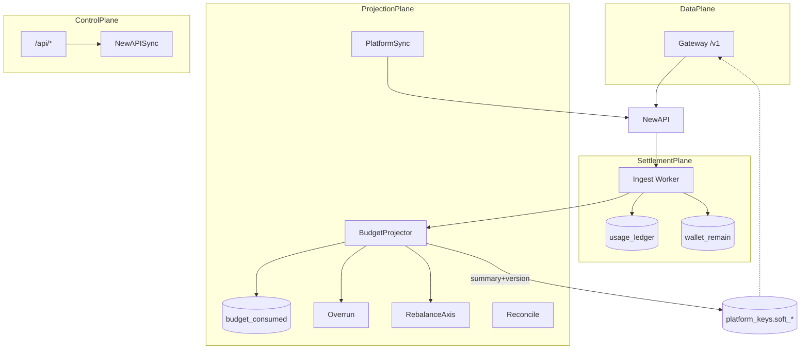
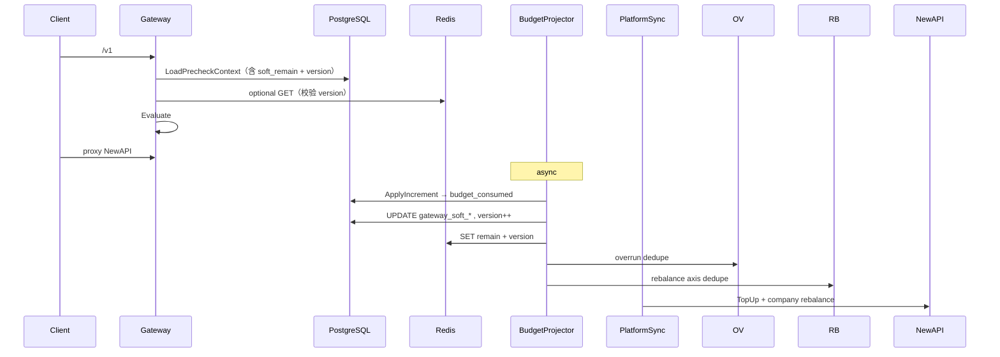

# 架构终态设计

> **定位**：TokenJoy Backend 的**目标架构**——以 Gateway 性能最优、域边界最简为准。  
> **读者**：架构 / Backend 开发 / 产品（执法模型与 PRD 对齐）。  
> **关联**：[Backend-架构.md](./Backend-架构.md) · [Backend-预算.md](./Backend-预算.md) · [Backend-离线任务.md](./Backend-离线任务.md)

---

## 1. 设计原则

| # | 原则 | 含义 |
| --- | --- | --- |
| **P0** | **摘要列是投影，不是事实** | `gateway_soft_*` 必须可由 `usage_ledger` + 预算树重算；Reconcile 是安全网；**事实只有 ledger + lots/wallet** |
| P1 | **热路径零远程、零重算** | Gateway：1× PG + 0~1× Redis GET + 纯内存 `Evaluate` |
| P2 | **事实单写** | 消耗只追加 `usage_ledger`；钱包只经 `domain/billing/lot/` 更新 `wallet_remain` |
| P3 | **投影可丢弃可重算** | `budget_consumed` / `usage_buckets` / 预检摘要列均可 TRUNCATE 后从 ledger 重建 |
| P4 | **冷路径合并同类项** | 同一 NewAPI 对齐一条 worker 链；remain 在 Projector 批内算一次 |
| P5 | **执法分层、职责单一** | 钱包 hard → 摘要 soft → Overrun Disable |

**Gateway 量化指标（终态）：**

| 指标 | 要求 |
| --- | --- |
| Store 调用 | **≤ 1**（`LoadPrecheckContext`） |
| 预检 HTTP | **0** |
| 钱包余额 | **O(1)** 读 `wallet_remain` |
| 预算 | 读 **Key 行摘要列**，不 JOIN `budget_consumed` |
| Redis | miss **放行**；value 带 **version**，禁止旧覆盖新 |

---

## 2. 一致性模型

后续开发**不得**按 Strong 语义误用 Eventual 数据。

| 数据 | 一致性 | Gateway / 业务能否当事实？ | 漂移修复 |
| --- | --- | --- | --- |
| `wallet_remain` | **Strong**（Ingest 同事务） | 是（L0 hard 挡） | 充值 / lot；`ReconcileWalletDrift` |
| `usage_ledger` | **Strong**（append-only） | 是（SSOT） | 不可改，仅追加 |
| `budget_consumed` | **Eventually consistent** | **否** | `budget_reconcile` → `SetConsumed` |
| `gateway_soft_remain` / `version` | **Eventually consistent** | 是（L1，带 lag 窗口） | Projector 批写；Reconcile 全量刷新 |
| `usage_buckets` | **Eventually consistent** | 否（看板） | `dashboard_reconcile` |
| Redis soft | **Best effort** | 可选增强；miss 放行 | Projector / Reconcile 重建 |

**超卖窗口上界** ≈ **Projection Lag**（见 §14）。摘要列错了 = Gateway 误拦或误放，因此 P0 + Reconcile 不可省。

---

## 3. 落地优先级（数据库变更最高）

> **未上线策略：** 一律写入 `schema.sql` + wipe，不做 migration 框架。

| 优先级 | 阶段 | 内容 | 类型 | 阻塞 |
| --- | --- | --- | --- | --- |
| **P0** | **D1** | **`platform_keys` 摘要三列 + 索引**（§11.2） | **Schema** | 一切摘要/Gateway 能力 |
| P0 | D2 | `LoadPrecheckContext` / store 类型扩展读摘要列 | 读路径 | Gateway Evaluate |
| P1 | C1 | Projector 批末：算 `minRemain` → UPDATE 摘要 + **`version++`** | 写路径 | L1 执法 |
| P1 | C2 | Reconcile 修漂移后刷新摘要 + version | 写路径 | 摘要安全网 |
| P2 | C3 | `Evaluate` 读 `gateway_soft_remain`；NULL 视为放行或 Reconcile 回填前降级 | Gateway | 预算 403 |
| P2 | C4 | Redis SET 带 version；GET 时 **Redis version ≥ PG version** 才采信 | Redis | 多 worker 安全 |
| P3 | C5 | Redis refresh 读摘要列，**删除** refresh 内 `LoadBudgetContext` | 性能 | 去重复计算 |
| P4 | C6 | `platform_sync` kind（wallet + company rebalance 串行） | 结构 | 入队合并 |
| P4 | C7 | Rebalance axis：一次 `LoadBudgetContext` / axis job | 性能 | 冷路径 |
| P5 | C8 | 监控 + Projection SLA 告警（§14） | 可观测 | 上线门禁 |
| P6 | C9 | 批末 side effect 扩展：Alert / Audit（函数内顺序，**不**先上插件框架） | 功能 | Roadmap |

```text
D1 Schema → D2 Store 读 → C1/C2 写摘要 → C3 Gateway → C4/C5 Redis → C6/C7 冷链优化 → C8 监控
```

**D1 完成前：** Gateway 仍可按现状（钱包 + Redis soft）；**不得** half-migrate 读不存在的列。

---

## 4. 四层平面



| 平面 | 职责 | 延迟 |
| --- | --- | --- |
| 数据面 | Precheck + 反代 | ms / 请求 |
| 结算面 | ledger + wallet | webhook ms ACK |
| 投影面 | consumed / 摘要 / 执法 / 看板 | 秒级 |
| 控制面 | CRUD / NewAPISync | 与 LLM 无关 |

---

## 5. 端到端主流程



---

## 6. Gateway 热路径

### 6.1 单次 SQL（D2）

```sql
SELECT
  c.status, c.wallet_remain,
  pk.status,
  pk.gateway_soft_remain,
  pk.gateway_soft_at,
  pk.gateway_soft_version,
  -- allowlist 子查询（现状）
FROM platform_keys pk
JOIN companies c ON c.id = pk.company_id
WHERE pk.key_hash = $1
```

`gateway_soft_remain`：参与预检各轴 **最紧 remain** 的 min（Projector 批末写入）。`member` = `min(key, personal, wallet)`；`project_member` 含 sub 与 project，见 [Backend-预算.md](./Backend-预算.md) §2.2 · `chain.go`。

### 6.2 Evaluate（C3）

```text
1. wallet_remain >= ε           → 否则 403
2. key active + allowlist       → 否则 403
3. soft_remain IS NOT NULL AND soft_remain <= 0 → 403
4. [Redis] blocked AND version 有效 → 403
5. pass
```

`soft_remain IS NULL`：摘要尚未投影（新 Key / 回填前）→ **放行** 或产品定「保守 403」；推荐放行 + 尽快 Reconcile/Projector 回填。

### 6.3 Redis（C4）

| 操作 | 规则 |
| --- | --- |
| SET | payload 含 `remain` + **`version`**（与 PG 同步） |
| GET | 仅当 `redis.version >= pg.gateway_soft_version` 且 remain≤0 才 block |
| miss / 旧 version | **放行**（PG 列仍生效） |

---

## 7. 结算面：Ingest

事务内：**ledger + wallet + `InsertTx(budget_projection)` + `InsertTx(platform_sync)`**。

不入队 overrun / axis rebalance（归 Projector）。

---

## 8. 投影面：BudgetProjector

### 8.1 单批流水线（C1）

```text
ApplyIncrement → budget_consumed
→ 批量 UPDATE platform_keys SET
     gateway_soft_remain = $remain,
     gateway_soft_at = NOW(),
     gateway_soft_version = gateway_soft_version + 1
   WHERE id = ANY($touched) AND … -- 可选：仅当新 remain 更严或 version 单调
→ Refresh Redis（带 version）
→ dedupe overrun / rebalance axis
→ chain budget_projection if full batch
```

**Version 规则：** 每个 Key 单调递增；Redis SET 必须带同一 version；避免慢 worker 用旧 batch 覆盖新摘要。

### 8.2 批末扩展点（C9，非插件框架）

顺序固定，新增能力**插入同函数末尾**即可：

```text
SummaryUpdater → RedisUpdater → OverrunEnqueue → RebalanceEnqueue → [AlertListener] → [AuditListener]
```

Alert（80%/90%）读 `budget_consumed` + `alert_rules`，**不在 `/v1`**。

---

## 9. PlatformSync（C6）

```text
Work(company_id):
  1. SyncCompanyWallet()      -- delta TopUp，delta=0 则 no-op
  2. RebalanceAxis(company)
```

**幂等（不必额外 wallet_version 协议）：**

| 层 | 机制 |
| --- | --- |
| River | `platform_sync` Args：`company_id` unique + **5s ByPeriod**（继承现 `wallet_sync`） |
| 业务 | `SyncCompanyWallet` 算 delta；Rebalance 比较 token remain 再 Update |

连续充值 / Reconcile 重复入队 → debounce + delta=0，**不重复打 NewAPI**。

---

## 10. Rebalance 触发矩阵

| 场景 | 入队 kind | axis | 说明 |
| --- | --- | --- | --- |
| Ingest 入账 | — | — | **不**直接 rebalance；走 Projector |
| Projector 批末 | `rebalance` | member / dept / group | touched axes dedupe |
| Projector 批末 | — | company | **不**入队；交给 `platform_sync` |
| 充值 / 调账 / 赠金 | `platform_sync` | company（内含） | 替代 wallet + rebalance 双 job |
| Reconcile 修漂移 | `platform_sync` | company（内含） | 摘要刷新后对齐 NewAPI |
| 月切 | `monthly_rebalance` → `rebalance` | company | fanout |
| 预算树 / 成员额度变更 | `rebalance` | 对应 axis | `newapisync.SyncJobEnqueuer` / `budget.JobEnqueuer`（`app/*_enqueuer.go`） |
| 审批通过 Key / 删组 | `rebalance` / `newapi_sync` | 视场景 | 见 `newapisync` / keys |
| **Gateway 请求** | **否** | — | 热路径禁止 |

---

## 11. 数据模型（P0 · 最高优先级）

### 11.1 Schema 增量（D1 · 写入 `schema.sql`）

```sql
ALTER TABLE platform_keys
  ADD COLUMN gateway_soft_remain  NUMERIC(18, 6),
  ADD COLUMN gateway_soft_at      TIMESTAMPTZ,
  ADD COLUMN gateway_soft_version BIGINT NOT NULL DEFAULT 0;

COMMENT ON COLUMN platform_keys.gateway_soft_remain IS
  'Projector/Reconcile 维护的最紧 remain；投影，非 SSOT';
COMMENT ON COLUMN platform_keys.gateway_soft_version IS
  '摘要单调版本；Redis SET 与 PG 对齐，防旧批覆盖';

-- 可选：Reconcile 扫 stale 摘要
CREATE INDEX IF NOT EXISTS idx_platform_keys_soft_stale
  ON platform_keys (company_id, gateway_soft_at)
  WHERE gateway_soft_remain IS NOT NULL;
```

**回填策略（wipe 后首跑）：**

1. 部署空列 → Projector 从 cursor 0 跑满 → 摘要自然填充  
2. 或 seed/demo 后跑一次 `budget_reconcile` + 全量摘要刷新 job  

**禁止：** 无列先改 Gateway Evaluate（D1 未落地）。

### 11.2 表职责

| 表 / 列 | SSOT？ | Gateway 读？ |
| --- | --- | --- |
| `usage_ledger` | 是 | 否 |
| `wallet_remain` | 是 | 是 |
| `budget_consumed` | 投影 | 否 |
| `gateway_soft_*` | 投影 | **是** |
| `usage_buckets` | 投影 | 否 |

---

## 12. 执法模型

| 层级 | 机制 | 窗口 |
| --- | --- | --- |
| L0 | `wallet_remain` | 无 |
| L1 | `gateway_soft_remain` + Redis(version) | ≤ Projection Lag |
| L2 | Overrun Disable Key | 同上 |

---

## 13. 冷路径：Reconcile 与看板

| Job | 周期 | 职责 |
| --- | --- | --- |
| `budget_reconcile` | 30min | `SetConsumed` 修漂移 → **刷新摘要+version** → `platform_sync` |
| `dashboard_project` | 1h | ledger → buckets |
| `dashboard_reconcile` | 24h | buckets 对账 |

---

## 14. 可观测与 Projection SLA（C8）

### 14.1 指标

| 指标 | 含义 |
| --- | --- |
| `projection_lag_seconds` | `now - max(ledger.occurred_at where id > cursor)` |
| `projection_queue_depth` | `river_job` kind=`budget_projection` pending |
| `projection_batch_duration_seconds` | Projector `RunBatch` 耗时 |
| `gateway_soft_null_keys` | `gateway_soft_remain IS NULL` 的 active key 数 |
| `gateway_precheck_duration_seconds` | `/v1` 预检延迟 |
| `gateway_sql_calls` | 应恒为 1 |
| `redis_soft_hit_rate` | soft GET 命中 / 总量 |
| `overrun_jobs_total` | overrun 执行次数 |
| `platform_sync_success_rate` | platform_sync 成功比 |
| `reconcile_repairs_total` | Reconcile 修漂移条数 |

### 14.2 SLA 分级

| 级别 | `projection_lag_seconds` | 动作 |
| --- | --- | --- |
| **正常** | < 0.5s | — |
| **warning** | ≥ 0.5s | 日志；观察 queue depth |
| **degraded** | ≥ 1s | 告警；超卖窗口扩大 |
| **critical** | ≥ 5s | 页面上线；评估暂停大 tenant / 加 worker |

设计目标：**P99 lag ≤ 1s**（degraded 线），不是「仅写在文档里」。

**落地路线图（不牺牲 Gateway / Ingest 热路径）**：[Backend-v1-Ingest链路优化.md](./Backend-v1-Ingest链路优化.md) §10（双赢项 I1/P1/I5 等 + 背景调参 L1/L2）。

---

## 15. 失败恢复（Runbook 摘要）

| 故障 | 现象 | 恢复 |
| --- | --- | --- |
| Projector 卡住 | lag critical；queue 堆积 | 查 `budget_projection_progress`；手动 `Insert(budget_projection)`；必要时 chain |
| 摘要漂移 / NULL | Gateway 误拦或全放行 | 跑 `budget_reconcile` → `SetConsumed` → 批刷新 `gateway_soft_*` |
| Redis 全丢 | soft 挡失效 | Gateway 仍读 PG 摘要；Projector/Reconcile 重建 Redis |
| PlatformSync 失败 | NewAPI quota 偏差 | River retry；`ReconcileWalletDrift` 兜底入队 |
| NewAPI 不可用 | sync/overrun 失败 | 重试；Gateway **不受影响** |
| PG 摘要与 consumed 不一致 | Reconcile 日志 `drift repaired` | 自动；确认 Repair 后 version 递增 |

**重建命令级路径（概念）：** `TRUNCATE budget_consumed, budget_projection_progress` → fanout `budget_reconcile` → Projector 重跑 → 摘要全量回填。

---

## 16. River Job 终态

```text
critical:  newapi_sync
default:   budget_projection, platform_sync, rebalance, overrun, org_sync
low:       budget_reconcile*, dashboard_*, monthly_rebalance
非 River:  ingest_worker
```

---

## 17. 明确不做

Gateway JOIN `budget_consumed` · Redis 钱包 SSOT · Redis miss 回源 PG · Ingest 入队 overrun · Reconcile 用 `ApplyIncrement` · Gateway 503 sync lag · DB migration 框架 · 未压测上整包 PrecheckContext cache · **Projector 插件/Event 框架（过早）** · 多 Region/Kafka/CQRS 写进主文档

---

## 18. 验收清单

- [ ] **D1** `schema.sql` 含三列 + 注释；wipe 后表结构正确
- [ ] **C1** Projector UPDATE 摘要且 `version` 单调
- [ ] **C3** 摘要 ≤0 → Gateway 403；`TestGatewaySingleStoreCall` 仍 pass
- [ ] **C4** Redis 旧 version 不覆盖新 PG 摘要
- [ ] **C6** 充值仅 1 条 `platform_sync` pending
- [ ] **C8** lag 指标可见；degraded 告警可达
- [ ] Reconcile 修漂移后摘要与 `ExpectedConsumed` 一致

---

## 19. 关联文档

[Backend-架构.md](./Backend-架构.md) · [Backend-预算.md](./Backend-预算.md) · [Backend-离线任务.md](./Backend-离线任务.md) · [Roadmap.md](./Roadmap.md)

---

## 20. 一句话

> **先落库（摘要三列 + version）→ Projector 写摘要 → Gateway 读摘要；事实仍在 ledger；lag 可观测；冷链合并为 platform_sync + rebalance_axis；Overrun 最终硬关。**
