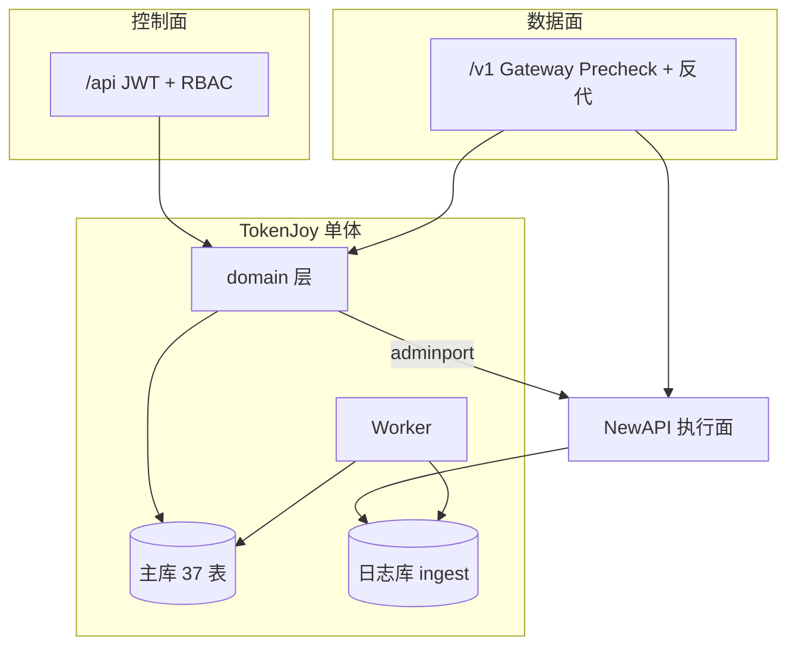
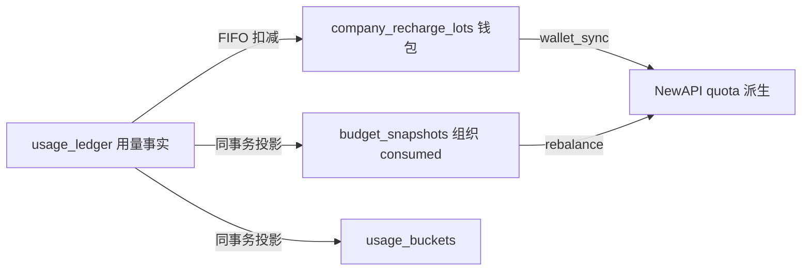
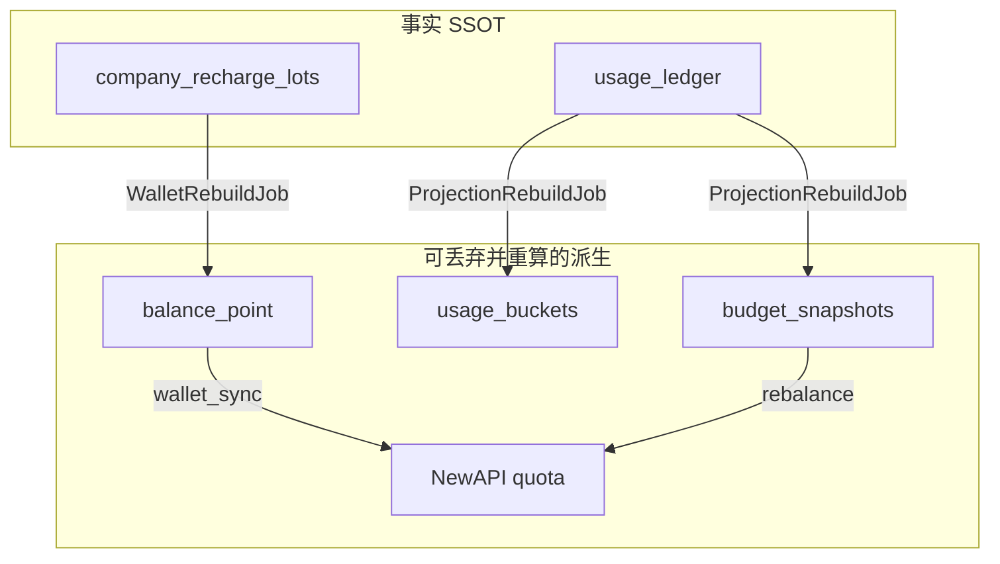
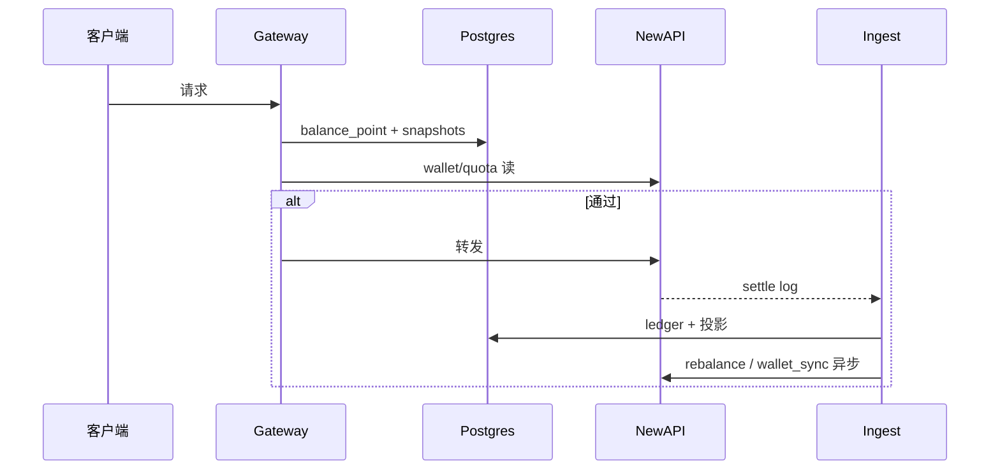
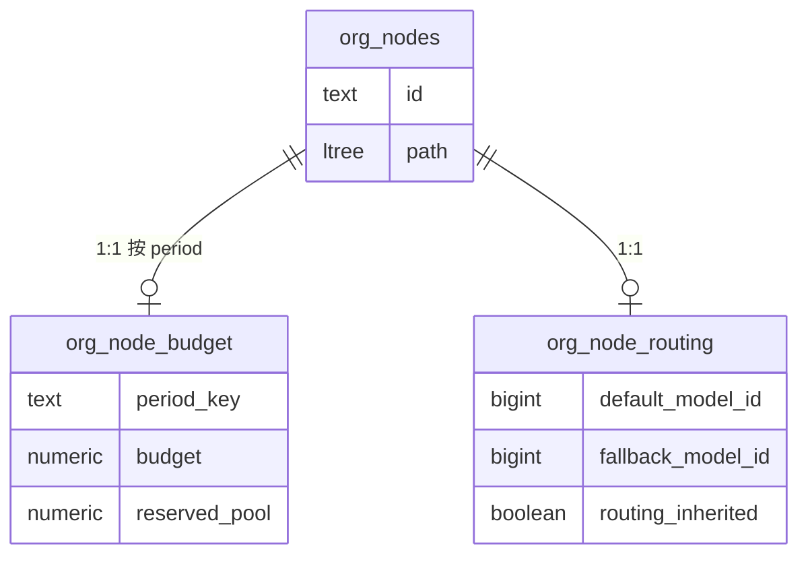
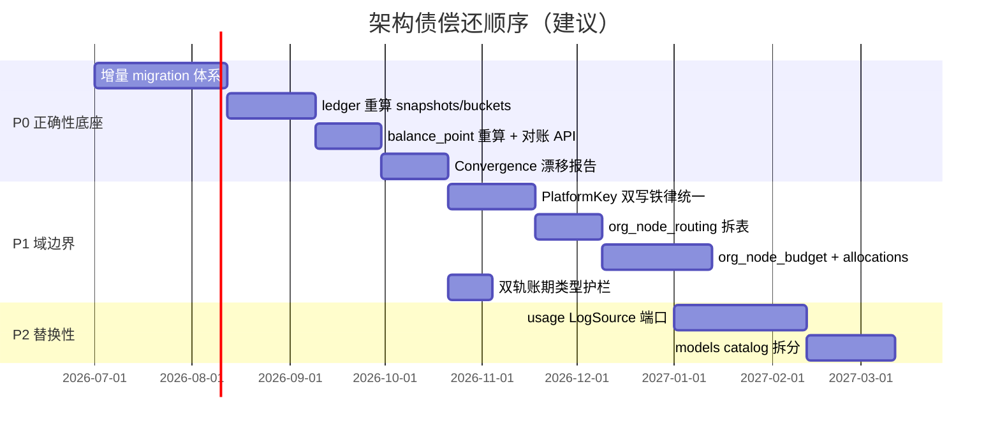

# TokenJoy 架构评审：长期维护目标与必改项

> **读者**：架构师、后端主程  
> **视角**：按**长期可维护、可演进**排序——只列会随时间放大的结构性问题；性能微调、文档笔误、前端 hook 缺口等不在本文范围  
> **依据**：`schema.sql`、domain/worker 实现、[Backend-架构.md](./Backend-架构.md)、[Backend-计费模式.md](./Backend-计费模式.md)、[Backend-业务时钟与账期.md](./Backend-业务时钟与账期.md)、[工程收口.md](./工程收口.md)  
> **日期**：2026-07-11

---

## 1. 怎么用这份文档

| 问题 | 答案 |
| --- | --- |
| 当前架构方向对不对？ | **对**——控制面/数据面分离、三 SSOT、modular monolith、ledger + 投影，都是可长期演进的选型 |
| 现在最该改什么？ | **见 §4**——按 P0→P2 排序的 7 项架构债 |
| 要不要拆微服务？ | **不要**（见 [工程收口.md](./工程收口.md) §4「明确不做」） |
| 小问题去哪看？ | [plan.md](./plan.md)、[工程收口.md](./工程收口.md) |

**一句话：** 底座不用推翻；长期维护的瓶颈是 **「事实有了、派生能漂移、schema 不能演进、域边界在表上糊在一起」**。

---

## 2. 现状骨架（保留认知用）

**三个 SSOT 世界**（长期应维持，不要合并成一张总账）：

| 世界 | SSOT | 派生/缓存 |
| --- | --- | --- |
| 用量 | `usage_ledger` | `usage_buckets`、审计聚合 |
| 组织预算 | `budget_snapshots`（四轴 × `period_key`） | Gateway 预检、预算树 |
| 企业钱包 | `company_recharge_lots` + `balance_point` | NewAPI `users.quota` |

**应保留的架构决策（勿动方向）：**

- `/api` 与 `/v1` 分轨；Gateway OpenAI 兼容反代
- `adminport.Port` 隔离 NewAPI Admin
- consumed 不进 `org_nodes` / `platform_keys` 列，统一 `budget_snapshots`
- `platform_keys` 与 `platform_key_mappings` 拆分
- Ingest：ledger INSERT + `projection.Apply` 同事务
- 单进程 Worker + River `river_job`（规模未到再拆池，不必拆服务）；见 [Backend-离线任务.md](./Backend-离线任务.md)

---

## 3. 长期维护的终态目标

上线后 1–3 年，系统应满足：

1. **事实可重建** — `usage_ledger` / `company_recharge_lots` 为唯一真相；snapshots、buckets、NewAPI quota 均可从事实 **全量或分段重算**
2. **Schema 可演进** — 有客户数据后仍能 **增量 migration**，不靠 `down -v` wipe
3. **域边界在代码与表上对齐** — 组织、预算配置、模型路由 **可独立变更、独立测试**
4. **外部执行面可替换** — NewAPI 仍是默认实现，但 Gateway + 同步 + 入账不假设其内部表结构
5. **双轨账期不可绕过** — 任何新消耗/预检路径自动走 `OpenBudgetPeriod` / `OccurredAt` 护栏

下面 §4 是当前与终态的差距，按 **不修会复利恶化** 的程度排序。

---

## 4. 必须改的架构问题（按重要性）

### P0-1 · 派生层无「从事实重建」能力

**现状**

- Ingest 在同事务写 `usage_ledger` → `budget_snapshots` + `usage_buckets` + lot 扣减
- 钱包靠 `wallet_sync` 把 `balance_point` 推到 NewAPI quota；预算靠 `rebalance` 推 Key quota
- 仅有 **ingest 补洞**（`reconcile_cursors`）和 **wallet 漂移 ε 对账**（[Backend-计费模式.md](./Backend-计费模式.md) §10）
- **没有**：从 ledger 重算整月 snapshots/buckets、从 lots 重算 `balance_point` 的正式 job

**为何是架构问题**

一旦投影 bug、手工改库、进程崩溃在 DB-first 与 Remote 之间留下窗口，**没有闭环手段**，只能人肉 SQL。使用越久、数据越大，修复成本指数上升。

**行业做法**

| 产品 | 模式 |
| --- | --- |
| **Stripe** | Balance Transactions 为事实；Invoice/摘要可重算；提供 reconciliation 与 backfill |
| **AWS CUR** | 明细 S3 + 聚合表；聚合可按分区重跑 |
| **银行核心** | 分户账 + 总账；日终批处理从分户重轧总账 |

**目标改法**

| 步骤 | 交付物 |
| --- | --- |
| 1 | `domain/usage.RebuildSnapshots(company_id, period_key)`：按 ledger 聚合写四轴 + buckets（可 TRUNCATE 后 INSERT 或 UPSERT 覆盖） |
| 2 | `domain/billing.RebuildBalancePoint(company_id)`：从 lots + ledger 闭合 |
| 3 | 运维入口：`POST /api/internal/rebuild/...` 或 CLI + `scheduler_locks` 互斥 |
| 4 | 定期 **抽样对账**：`Σ ledger.amount` vs `budget_snapshots` vs `usage_buckets` 超 ε 告警 |

**不改的后果**：任何入账/投影一次事故 = 永久脏数据或高风险手工修复。

---

### P0-2 · Schema 演进策略与生产现实冲突

**现状**

- [Backend-存储架构.md](./Backend-存储架构.md)：`go:embed schema.sql` 全量 apply；改表后 `docker compose down -v` 重建
- [Backend-计费模式.md](./Backend-计费模式.md) §10.3 红线：「不以增量 migration / 双写维持多套账本」

**为何是架构问题**

「不做双写账本」≠「不做 schema migration」。当前把 **migration 工具** 和 **多账本双写** 混为一谈。本地 wipe 可以；**有租户充值、审计留存后，无法 wipe**，任何 `org_nodes` 拆表、`models` 加列都会卡住。

**行业做法**

- 账本事实表只追加（ledger、lot）；**投影表**允许 migration + 重算（见 P0-1）
- 使用 golang-migrate / Atlas / Flyway；变更以 **additive** 为主（加列、加表、backfill job）

**目标改法**

| 阶段 | 动作 |
| --- | --- |
| 上线前 | 定调：**事实表变更 = migration + 可选 backfill**；投影表变更 = migration + RebuildJob |
| 工具 | 引入 migration 目录（如 `store/postgres/migrations/`），启动时 version 检查；`schema.sql` 保留为 **bootstrap 空库** 或 codegen 源 |
| 纪律 | 禁止 production `down -v`；seed 仅 local/demo |

**不改的后果**：P0-1 的拆表、P1 的 `org_nodes` 解耦、多币种等全部无法安全落地。

---

### P0-3 · 三世界 + 四重预检：最终一致模型未产品化

**现状（Gateway Phase 1 已落地，2026-07）**

请求 `/v1` 时 Gateway 热路径仅读 Postgres：

1. `companies.balance_point`
2. `budget_snapshots` + 各轴 limit（单 SQL `LoadPrecheckContext`）
3. 模型白名单 / Key 状态

**不再参与预检：** NewAPI Key `remain_quota`、企业钱包 quota、`wallet_sync` 滞后 503。实现见 [Backend-架构.md](./Backend-架构.md) §6。

Ingest 之后再改 1–2 的投影。长期运维契约仍缺一张 **「谁为准、漂移怎么办」** 说明（冷路径 `wallet_sync` / PlatformSync 负责消化漂移）。

**为何是架构问题**

不是「检查太多」，而是 **没有统一的 Convergence 抽象**：新人加预检条件、改 ingest 副作用时，不知道会不会破坏闭环。`wallet_sync` debounce、ε 漂移、ingest 与预检竞态（文档称可接受 overdraft）都散落多处。

**行业做法**

| 产品 | 做法 |
| --- | --- |
| **OpenAI** | 平台侧 rate limit + billing 一套；客户只见「能不能调」 |
| **Stripe** | 余额不足 decline；异步 invoice 与 balance 最终一致，有 dashboard 对账 |
| **K8s** | admission 看 ResourceQuota（硬）；metrics 事后校正 |

**目标改法**

1. **文档 + 代码层** 明确「硬门禁」为 **Postgres 事实**（`balance_point`、snapshots）与 **Key 有效性**；NewAPI quota 为 **执行面派生**（Phase 1 已退出 Gateway 热路径预检）
2. 统一 `domain/convergence`（或扩展现有 billing/usage）：`DriftReport(company_id)` → PG vs NewAPI vs 投影差值
3. Gateway 预检与 Ingest 共享 **同一套 Remain 计算**（`gateway.Evaluate` 内 `ComputeRemainBudget`，与 `pkg/budget.RemainForMapping` 对齐）

**不改的后果**：每加一个计费规则，预检/入账/同步三处各改一遍，回归面指数增长。

---

### P1-1 · `org_nodes` 多域共表：变更耦合

**现状**

一张 `org_nodes` 同时承载：

| 域 | 列 |
| --- | --- |
| 组织树 | `parent_id`, `path`, `manager_id`, … |
| 预算配置 | `budget`, `reserved_pool`, `period` |
| 模型路由 | `default_model_id`, `fallback_model_id`, `routing_inherited` |

三个 domain Service 写同一行。HTTP 层已投影为 `Department` / `BudgetNode` / `RoutingRule`，**物理表未跟逻辑边界对齐**。

**为何是架构问题**

- 功能增长 → 列继续堆在同一行 → 迁移、锁、测试互相牵连
- `reserved_pool` 与「已分配子账」语义不清，根因是 **预算配置没有独立实体**（见下）

**行业做法**

组织单元、预算方案、路由策略分资源（AWS OU vs Budget vs 路由表；ERP 组织 vs 编制 vs 科目）。

**目标改法**（依赖 P0-2 migration）

| 优先级 | 动作 |
| --- | --- |
| 先 | 路由列迁出 → `org_node_routing`（变更频率高、与 models 域耦合紧） |
| 后 | 预算配置迁出 → `org_node_budget(company_id, node_id, period_key)`，与 `budget_snapshots.consumed` 对称 |
| 同步 | 预算「已承诺分配」进 `budget_allocations` 或审批时扣减 `reserved_pool`（**业务不变式**，不是性能问题） |

**不改的后果**：预算、路由、组织任一域的大改都牵动全表；多账期对比、历史预算配置无法做。

---

### P1-2 · PlatformKey 与 NewAPI 双写顺序不一致

**现状**

| 操作 | 顺序 | 代码 |
| --- | --- | --- |
| Create / Revoke / Toggle | **Remote-first** | `SyncRevoke` → 再写 DB |
| Update 配额/白名单 | **DB-first** | `SetPlatformKeys` → `SyncUpdate` → 失败回滚 |

DB-first 在 **Sync 成功前崩溃** 会短暂不一致；Remote-first 在 **Remote 成功后 DB 失败** 会 orphan。两种失败模式不同，运维 playbooks 难统一。

**行业做法**

Outbox / Saga：**先本地事务写意图 + outbox**，Worker 异步调外部；或统一 Remote-first + 本地 staging 状态机（`provisioning` → `active`）。

**目标改法**

1. **统一为 Remote-first + outbox**（与 Create 路径一致）：Update 也只写 `river_job(newapi_sync)`，成功回调再 commit 业务状态；或
2. **统一为 DB 事务 + River 入队**：任何 PlatformKey 变更 = `platform_keys` + `river_job(newapi_sync)` 同一事务（`InsertTx`）；见 [Backend-离线任务.md](./Backend-离线任务.md)

`工程收口.md` §1.3 已标为上线前按需项——从架构债角度，应在第一个生产客户前 **定一种铁律**。

**不改的后果**：Key 状态在 Postgres 与 NewAPI 之间漂移；Ingest 依赖 mapping，漂移直接变成 **丢账或错账**。

---

### P1-3 · 双轨账期：系统级复杂度未固化

**现状**

- **开账月** `OpenBudgetPeriod` → 预检、overrun、`budget_snapshots` 读写
- **发生月** `OccurredAt` → `usage_ledger`、财务、`usage_buckets` 时间轴

仅 Ingest 同时处理两轨（[Backend-业务时钟与账期.md](./Backend-业务时钟与账期.md)）。未来若加：手工调账、冲正、离线导入、第三方账单，极易用错 `period_key`。

**行业做法**

会计系统明确 **会计期间（posting period）** vs **业务日期（value date）**；过账接口强制双字段。

**目标改法**

1. 类型层：`type BudgetPeriod string` / `type OccurrenceMonth string`，禁止裸 `string` 混用
2. 所有写 consumed 的路径必须经过 `usage.BuildCallSettledEntry` 同类入口，单测覆盖「6/30 发生、7/1 入账」
3. 管理面展示：预算树标注「当前账期 consumed」；审计标注「发生月」

**不改的后果**：每新增一条写账路径，都可能破坏月结与门禁——**隐性回归炸弹**。

---

### P2-1 · 执行面强绑定 NewAPI 单体拓扑

**现状**

- Gateway `httputil.ReverseProxy` 直连 `NEW_API_BASE_URL`
- 入账读 `newapi.logs`（日志库），归因 `newapi_key_id`
- 生产契约要求 NewAPI + Gateway 同开

`adminport` 已抽象 Admin API，但 **数据面仍假设 NewAPI 的 log 形状与 webhook 协议**。

**行业做法**

| 层级 | LiteLLM / Portkey | TokenJoy 目标 |
| --- | --- | --- |
| 代理 | 可换上游 | Gateway 上游可配置 |
| 计量 | 自建 log 或 vendor webhook | **`usage_ledger` 不依赖 log 列布局** |
| 配额 | 代理内或 vendor | Postgres 硬门禁 + vendor 软缓存 |

**目标改法**（非紧急，但影响 2–3 年替换成本）

1. 定义 `domain/usage.LogSource` 接口：`FetchSettledCall(log_id) → SettledCall`；NewAPI 为一种 adapter
2. Webhook payload 只传 `log_id` + 签名校验，解析在 adapter 内
3. 文档标明：**替换执行面 = 换 adapter + Gateway 上游**，不动 ledger 模型

**不改的后果**：换上游或 NewAPI 大版本升级 = 全链路重写风险。

---

### P2-2 · `models` 平台目录与租户模型同表

**现状**

`models.company_id` 区分平台内置与租户自定义；Gateway 用 `type`（callType），管理面用 `modelId`，白名单用 `model_id`。

**为何列入 P2 而非忽略**

catalog 会持续增长（多厂商、多模态、定价版本）。同表导致 **可见性规则、禁用语义、迁移** 都靠 `company_id == TOKENJOY_COMPANY_ID` 约定，无法做平台级「下架旧模型」而不影响租户历史 ledger。

**目标改法**

- 逻辑拆表或加 `origin platform|tenant` + 平台 `model_catalog` 与租户 `tenant_model_overrides`
- 单一 ADR：`modelId` / `callType` / allowlist / Gateway precheck 映射图（实现前必写）

---

## 5. 明确不在本期改的（避免过度工程）

来自 [工程收口.md](./工程收口.md) §4，与长期维护一致：

| 不做 | 原因 |
| --- | --- |
| 拆微服务 / bounded context 改名 | 团队与部署形态不需要 |
| 5 张 queue 表 | 已收口为 River `river_job` + kind；见 [Backend-离线任务.md](./Backend-离线任务.md) |
| 全量 service 窄 repo 注入 | 渐进即可 |
| 为 N+1 提前上 CQRS 物化视图 | 批量读 snapshot 即可；树规模到阈值再议 |

---

## 6. 行业定位（简表）

TokenJoy = **企业费控（三 SSOT + 组织树）** + **LLM API 网关（OpenAI 兼容）**；执行面外包给 NewAPI。

| 维度 | TokenJoy | OpenAI Platform | LiteLLM 类代理 | 企业 ERP 费控 |
| --- | --- | --- | --- | --- |
| 控制面 | 自研 `/api` | Dashboard | 配置/YAML | 自研 |
| 数据面 | `/v1` → NewAPI | 自建 | 自建反代 | — |
| 用量事实 | `usage_ledger` | 内部 events | 可选日志 | 费用明细 |
| 预算 | 四轴 snapshot | Project limit | 简单 budget | 编制 + 发生 |
| 钱包 | lot + point | Invoice | 通常无 | 预付账户 |
| 重建能力 | **待建设 P0-1** | 有 backfill | 参差 | 日终重轧 |

差距不在「有没有 Gateway」，而在 **事实与派生是否有运维级重建、schema 能否演进**。

---

## 7. 演进路线（按终态倒排）

| 阶段 | 完成标志 |
| --- | --- |
| **P0 完成** | 生产可 migration；任一租户可触发「从 ledger 重算某月」且 Gateway 行为不变 |
| **P1 完成** | `org_nodes` 仅组织树；Key 变更只有一条 outbox 铁律；双轨账期有类型与 golden test |
| **P2 完成** | 换执行面 adapter 不需改 `usage_ledger`；平台模型下架不影响审计追溯 |

---

## 8. 相关文档

| 文档 | 何时读 |
| --- | --- |
| [Backend-架构.md](./Backend-架构.md) | 分层、Gateway、Worker 现状 |
| [Backend-计费模式.md](./Backend-计费模式.md) | 三世界、wallet_sync、红线 |
| [Backend-业务时钟与账期.md](./Backend-业务时钟与账期.md) | 双轨账期细则 |
| [Backend-Ingest架构.md](./Backend-Ingest架构.md) | 入账与投影（以 `projection.go` 为准） |
| [Backend-存储架构.md](./Backend-存储架构.md) | 表清单与 Store 映射 |
| [工程收口.md](./工程收口.md) | 上线前与「明确不做」 |

---

## 9. 结论

> **不必推翻 modular monolith 与三 SSOT；长期维护的胜负手是：事实可重建、schema 可演进、域边界从 `org_nodes` 上拆开、PlatformKey 与 NewAPI 只保留一种双写铁律。**  
> 完成 P0 后，P1/P2 可按产品节奏排期；在完成 P0 之前，任何大表拆分或生产改 schema 都应视为高风险。
