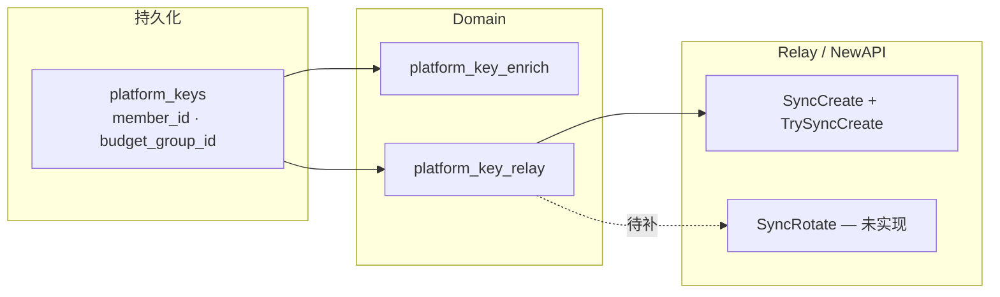
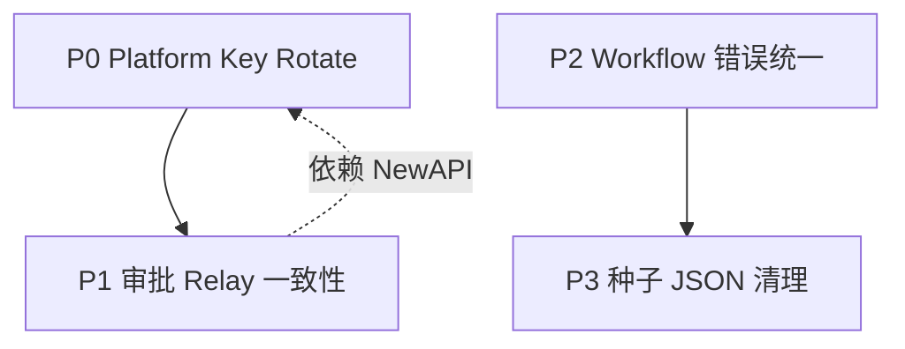

# Keys 域遗留实现规格

> **文档日期**：2026-07-07  
> **角色**：架构 / 研发接单  
> **范围**：兼容层清理后的**待实现能力**与**已知架构缺口**  
> **关联**：[Backend-存储.md](./Backend-存储.md) · [下一步工作清单.md](./下一步工作清单.md) §8

---

## 1. 文档定位

本文是**实现规格书**，不是变更记录。读者应能据此直接评估工作量、接口契约与验收标准。

**不在本文范围**：

- 已落地的 schema / enrich / Relay 创建 / 错误传播等（以代码与测试为准）
- Phase 3 性能规模化（见 [§5](#5-独立演进路线) 触发条件）

---

## 2. 架构基线（后续实现须遵守）



| 约束                     | 说明                                                                                                           |
| ------------------------ | -------------------------------------------------------------------------------------------------------------- |
| 无增量 migration         | 改 [`schema.sql`](../apps/backend/internal/store/postgres/schema.sql) 后 wipe 重建（`docker compose down -v`） |
| 推导字段不入库           | `memberName` / `projectName` 等仅 JSON enrich，禁止写回 `platform_keys`                                        |
| Platform Key secret 来源 | 必须经 Relay 下发；禁止本地生成 placeholder secret                                                             |
| Rotate 短期行为          | `RotatePlatformKey` → HTTP **501**，前端 toast；**不是**最终态                                                 |
| 错误语义                 | 资源不存在 → `404`；Relay 不可用 → `503`；未实现能力 → `501`                                                   |

---

## 3. 待实现：Platform Key 轮换（P0）

### 3.1 问题

「重新生成」需在同一 `platform_keys.id` 下更换 secret，并使旧 token 在网关侧失效。当前 Relay 接口仅有 Create / Update / Revoke，**无 Rotate**；Domain 层已显式返回 501，避免假 key。

### 3.2 目标行为

| 步骤 | 责任层                    | 行为                                                                           |
| ---- | ------------------------- | ------------------------------------------------------------------------------ |
| 1    | NewAPI Admin API          | 为已有 token 生成新 secret，吊销旧 secret                                      |
| 2    | `relay/interface.go`      | 新增 `SyncRotatePlatformKey(ctx, platformKeyID) (fullKey string, error)`       |
| 3    | `platform_key_actions.go` | 替换 501：校验 key 存在 → 调 Relay → `updatePlatformKeyFullKey` → enrich 返回  |
| 4    | 前端                      | `key-rotate-confirm` 成功路径恢复 `key-reveal`；501 提示可移除或保留为降级文案 |

### 3.3 接口草案

**Relay Lifecycle 扩展**（[`relay/interface.go`](../apps/backend/internal/domain/relay/interface.go)）：

```go
SyncRotatePlatformKey(ctx context.Context, platformKeyID string) (fullKey string, err error)
```

**HTTP**（不变）：

```
POST /api/keys/platform/{id}/rotate
→ 200 + PlatformKey（含新 fullKey）
→ 501 仅在新 API 未就绪的过渡期保留；上线后应消失
```

### 3.4 实现要点

1. **与 Create 对称**：复用 [`platform_key_relay.go`](../apps/backend/internal/domain/keys/platform_key_relay.go) 中 `updatePlatformKeyFullKey`，不新增 DB 列。
2. **Relay 未启用**：返回 `503`，与 Create 一致。
3. **Outbox**：若 Rotate 走异步，需定义 `OutboxKindRotateToken` 并在 worker 中处理；优先评估 NewAPI 是否支持同步 rotate，以减少状态机复杂度。
4. **审计**：操作日志 action 建议沿用 `key_rotate`（前端 [`audit`](../apps/frontend/src/features/audit/lib/labels.ts) 已有文案）。

### 3.5 验收

| #   | 场景                    | 预期                                                    |
| --- | ----------------------- | ------------------------------------------------------- |
| 1   | Relay 开启，rotate 成功 | DB `full_key` / `key_prefix` 更新；API 返回新 `fullKey` |
| 2   | Relay 关闭              | `503`                                                   |
| 3   | 不存在的 key id         | `404`                                                   |
| 4   | 网关侧                  | 旧 secret 不可再调用（需联调 NewAPI 确认）              |
| 5   | 前端                    | 确认后进入 key-reveal；失败展示 `ApiError.message`      |

### 3.6 依赖

- **阻塞**：NewAPI 提供 token rotate 或等价 Admin 端点（需与网关团队对齐 URI 与幂等语义）。
- **可并行**：前端 UX（隐藏菜单 vs 保留入口）在产品确认前可维持现状。

---

## 4. 待加固：审批通过 + Relay 同步的跨事务一致性（P1）

### 4.1 问题

[`ApproveApproval`](../apps/backend/internal/domain/keys/approval.go) 在事务内将审批标为 `approved` 并写入 `pending...` 的 Platform Key；事务提交后再调 `syncPlatformKeyCreate`。若 Relay 失败，会出现：

- 审批状态：**已通过**
- Key：`key_prefix = pending...`，无有效 `full_key`
- API 向审批人返回 **错误**，但状态不会自动回滚

与「创建 Key」单路径不同：Create 在同步失败时可整体失败；审批路径已提交业务状态。

### 4.2 可选方案

| 方案                      | 描述                                                                                           | 权衡                                        |
| ------------------------- | ---------------------------------------------------------------------------------------------- | ------------------------------------------- |
| **A. 同步前移**           | Relay `TrySyncCreate` 放入事务前；仅事务内写最终 `full_key`                                    | 事务变长；Relay 超时影响审批吞吐            |
| **B. 补偿 + 可重试状态**  | 审批通过后 key 标记 `provisioning`；失败保留 pending，提供管理端「重试同步」或 outbox 自动重试 | 状态机增加；用户体验最清晰                  |
| **C. 事务后失败回滚审批** | sync 失败时将审批改回 `pending` 并删除 key                                                     | 实现简单；审批人可能已看到「通过」的瞬时 UI |

**架构建议**：采用 **B**，与现有 Relay outbox（`OutboxKindCreateToken`）模式一致，避免在 HTTP 请求内阻塞长轮询。

### 4.3 待产出

1. 状态枚举：`platform_keys.status` 是否扩展 `provisioning` / `sync_failed`（或仅用 `pending` + `full_key IS NULL` 判断）。
2. 重试入口：worker 已有 create outbox；审批创建是否复用同一条 outbox 链路。
3. 前端：审批通过后 sync 失败时的提示与刷新策略（避免显示「已通过」但无可用 Key）。

### 4.4 验收

| #   | 场景                      | 预期                                                              |
| --- | ------------------------- | ----------------------------------------------------------------- |
| 1   | 审批 key 类型，Relay 成功 | 审批 approved + key 有 fullKey                                    |
| 2   | 审批 key 类型，Relay 失败 | 审批状态与 key 状态**可解释**；支持重试或明确失败态，不得静默成功 |
| 3   | 重试成功                  | 无需重新审批即可获得 fullKey                                      |

---

## 5. 待统一：Workflow 错误展示（P2）

### 5.1 问题

[`workflowErrorMessage`](../apps/frontend/src/features/workflow/lib/error-message.ts) 已在 keys / models 相关 workflow 接入，但以下组件在 API 失败时**未**统一展示 `ApiError.message`：

| 文件                                                 | 现状                                   |
| ---------------------------------------------------- | -------------------------------------- |
| `member-form.tsx`                                    | `toast.error('操作失败' / '邀请失败')` |
| `member-search.tsx`                                  | `catch` 静默清空结果，无用户提示       |
| `budget-group-form.tsx`、`budget-impact-preview.tsx` | `toast.error('保存失败')`              |
| `whitelist-config.tsx`                               | 校验类 toast 保留；保存失败为固定文案  |
| `overrun-policy.tsx`                                 | `toast.error('保存失败')`              |
| `import-preview.tsx`                                 | `toast.error('导入失败')`              |
| `role-form.tsx`、`role-add-member.tsx`               | 固定失败文案                           |

**已接入**（勿重复改）：`key-form`、`approval-review`、`model-create/edit`、`provider-key-form`、`reject-reason`。

### 5.2 实现规格

1. 所有 `features/workflow/workflows/**` 内手写 `catch` 统一改为：

   ```ts
   catch (err) {
     toast.error(workflowErrorMessage(err, '<fallback>'))
   }
   ```

2. 已使用 [`useWorkflowSubmit`](../apps/frontend/src/features/workflow/use-workflow-submit.ts) 的表单优先走 hook，避免重复 catch。

3. **禁止**在 catch 内用二次请求「猜」错误原因（`approval-review` 旧模式已移除，勿回退）。

### 5.3 验收

- 后端返回 `422` / `403` 等时，toast 展示服务端 `message` 字段（可 mock `ApiError` 单测或 E2E 抽一条）。

---

## 6. 待清理：种子数据契约（P3）

[`platform_keys.json`](../apps/backend/internal/store/seed/data/platform_keys.json) 仍含 `memberName`、`budgetGroupName`、`appName` 等**已不入库**字段。Loader 可反序列化，但 insert 已忽略，易造成维护误解。

**动作**：从 JSON 删除冗余键，仅保留 `memberId`、`budgetGroupId` 及业务字段；展示名依赖 enrich 验证（已有 handler 测试可扩展）。

---

## 7. 运行与部署约束（待写入运维说明）

| 项              | 要求                                                                               |
| --------------- | ---------------------------------------------------------------------------------- |
| 本地开发        | 创建 Platform Key / 审批发 Key **必须**启用 Relay（`NewAPI` 相关 env）；否则 `503` |
| 数据库          | 拉取含 `platform_keys` 列变更的代码后，**必须** `docker compose down -v` 重建      |
| Platform Rotate | 功能未上线前，产品需知「重新生成」暂不可用（501）                                  |

建议在团队 onboarding / README 中单列「Keys + Relay」小节（本文不重复运维命令细节）。

---

## 8. 独立演进路线（非本清理阻塞）

以下属 [下一步工作清单.md](./下一步工作清单.md) §8，**与兼容层清理无依赖**，按量化或业务触发立项：

| 触发                                 | 能力                                                      |
| ------------------------------------ | --------------------------------------------------------- |
| `platform_keys` > 500 或 P99 > 300ms | SQL 筛选 / 真分页 / 后端 `q` 搜索                         |
| 上线前安全要求                       | 列表 RBAC（后端默认 `departmentId`）                      |
| 产品要求                             | `models.visibility` 运行时与 allowlist / 部门路由合并校验 |

**约束延续**：不新增平行 enrich API；列表筛选与 enrich 同路径完成。

---

## 9. 优先级与建议排期



| 优先级   | 项                     | 预估依赖               |
| -------- | ---------------------- | ---------------------- |
| **P0**   | §3 Platform Key Rotate | NewAPI rotate API      |
| **P1**   | §4 审批同步一致性      | P0 或 outbox 设计评审  |
| **P2**   | §5 Workflow 错误       | 无外部依赖，可随时排入 |
| **P3**   | §6 种子 JSON           | 无外部依赖             |
| **按需** | §8 Phase 3             | 性能 / 安全触发        |

---

## 10. 实现索引（待改文件）

| 待办          | 主路径                                                                             |
| ------------- | ---------------------------------------------------------------------------------- |
| Rotate API    | `domain/relay/interface.go` · `domain/keys/platform_key_actions.go` · Relay worker |
| 审批一致性    | `domain/keys/approval.go` · `infra/worker` · 可选 schema `status`                  |
| Workflow 错误 | `features/workflow/workflows/*.tsx`                                                |
| 种子 JSON     | `store/seed/data/platform_keys.json`                                               |
