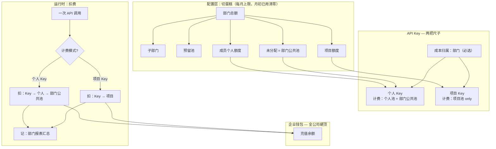
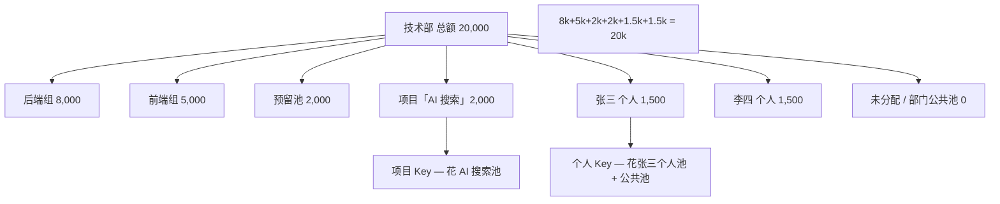
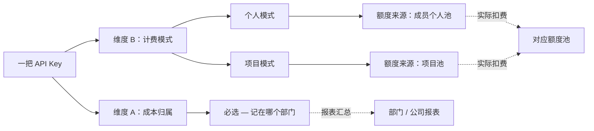
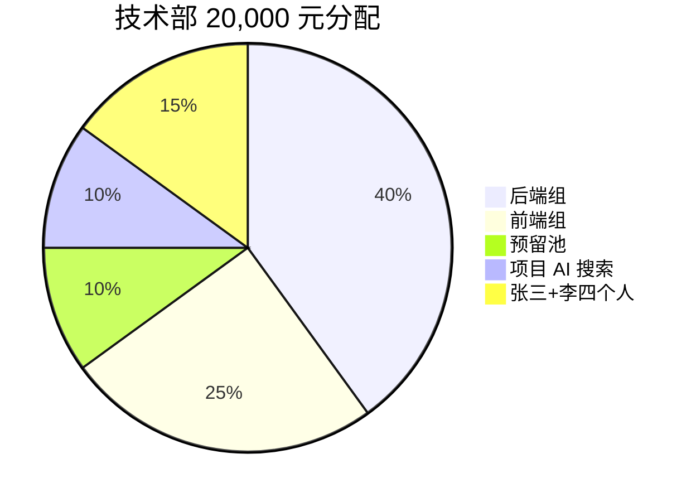
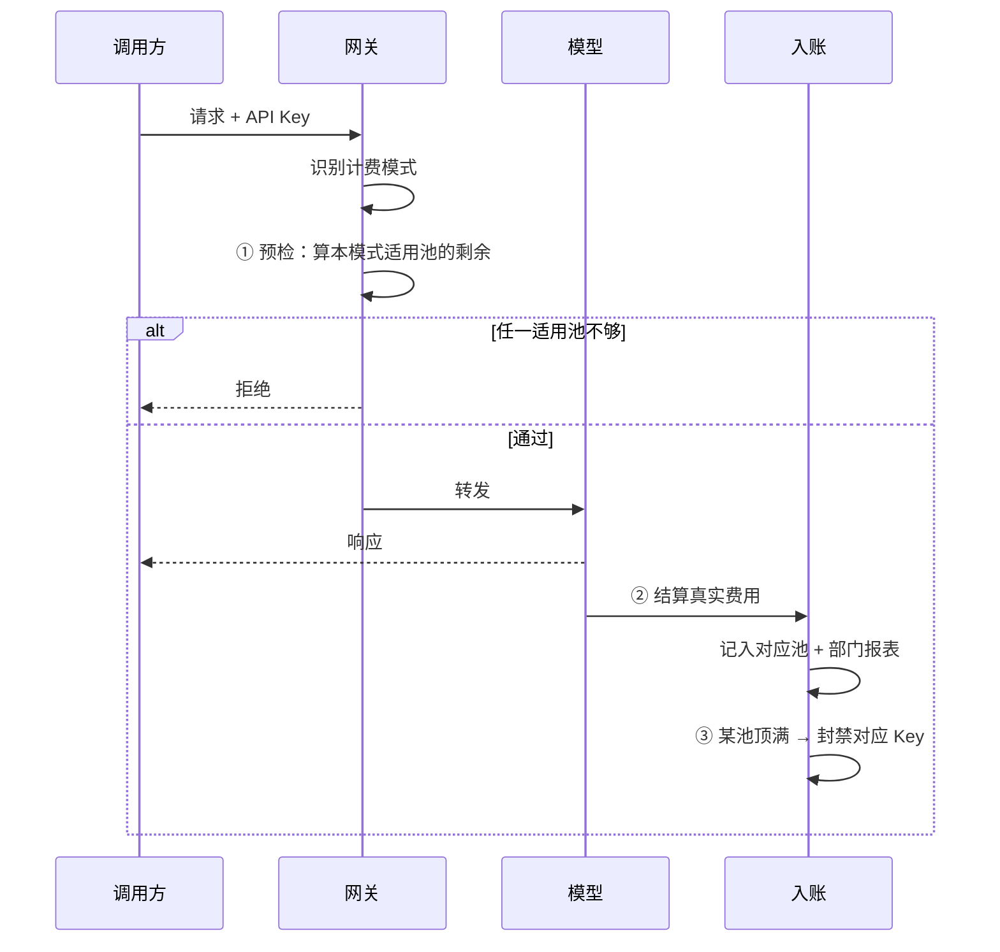
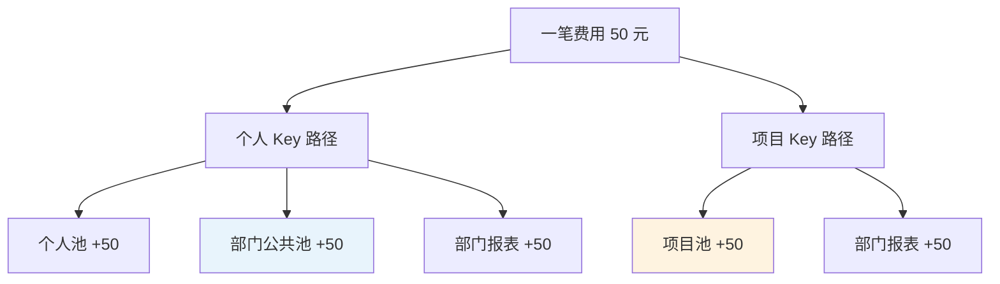
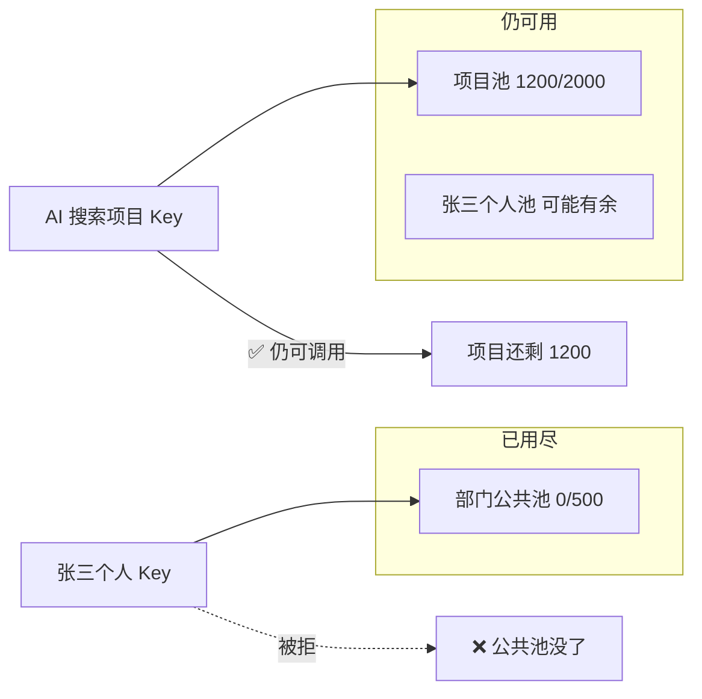

# 预算分配与扣减

**产品权威设计**：说明部门、项目、个人额度如何分配，API Key 如何挂接，以及扣费时怎样判断超支。

本文采用**「配置切蛋糕」与「运行时独立结算」分离**的模型：项目额度在配置时从部门切出，运行时与个人池、部门公共池**分开扣费**。

**相关：** [PRD.md](./PRD.md) US-07 · [Backend-预算.md](./Backend-预算.md) · [命名统一.md](./命名统一.md)

---

## 1. 一张图看懂全貌



**三句话：**

1. **配置时**：部门总额是一块蛋糕，切成子部门、预留池、项目、个人额度；切走的不算进「部门公共池」。
2. **运行时**：个人 Key 花**个人池 + 部门公共池**；项目 Key 只花**项目池**——部门公共池用完，**不影响**还有余额的项目。
3. **每笔费用**都会记在部门报表上（成本归谁），但**拦不拦得住**只看对应计费池 + Key 自身 + 企业钱包。

---

## 2. 术语

| 名称 | 含义 |
| --- | --- |
| **部门总额** | 组织树上该部门本月预算上限 |
| **部门公共池** | 部门总额减去已切给子部门、预留池、项目、成员个人额度后的**未分配部分**；供个人 Key 消耗 |
| **预留池** | 从部门总额划出，供审批追加给个人；**不能直接调 API** |
| **项目** | 虚拟项目组，有独立预算上限；界面显示「项目」 |
| **个人额度** | TL 给成员配置的上限，不是账单算出来的数 |
| **Key 额度** | 从个人池或项目池再分给单把 Key 的上限（可选） |
| **成本归属部门** | 每笔费用记在哪个部门名下（报表、权限、模型范围） |
| **计费模式** | 钱从哪个池扣：**个人** 或 **项目**（二选一） |
| **本账期已用** | 当月累计实际花费；每月 1 日已用清零，配置不变 |
| **企业钱包** | 公司充值余额，全公司硬顶，与组织分配独立 |

---

## 3. 两个层面，两套逻辑


| 层面 | 问什么 | 有没有「先扣谁」 |
| --- | --- | --- |
| **配置** | 部门 20,000 怎么分给子部门 / 预留 / 项目 / 个人 | **没有先后**，各项并列占用总额 |
| **运行时** | 这一笔 50 元从哪扣 | **有计费模式**：个人 Key 和项目 Key 走不同池；**不是**从部门总额再扣一遍项目已切走的部分 |

---

## 4. 部门、项目、个人：什么关系？



### 4.1 配置守恒式

```
部门总额
  = 子部门之和
  + 预留池
  + 挂在该部门的项目额度之和
  + 该部门成员个人额度之和
  + 未分配（部门公共池）
```

**项目不是部门之外的第二笔钱**——项目额度是部门蛋糕里切走的一块。切走之后：

- 项目池有独立上限 2,000，本账期最多花 2,000；
- 这 2,000 **不再占用**部门公共池的可用额；
- 运行时项目 Key **不再受**部门公共池是否用完的约束。

### 4.2 个人 vs 项目

| | 个人额度 | 项目额度 |
| --- | --- | --- |
| **谁配置** | TL 按人 | TL 建项目时分配 |
| **给谁用** | 该成员的个人 Key | 该项目下的 Key |
| **和部门公共池** | 个人池花完后，还可花公共池（若产品允许）或仅花个人池 | 无关 |
| **互相兜底** | 不能拿项目池给个人 Key 用 | 不能拿个人额度给项目 Key 用 |

---

## 5. API Key 怎么设计

### 5.1 两个维度，不要混成一个



**一把 Key 必有部门归属，且计费模式二选一。**

- **不是**「同时属于部门和项目两个扣费池、各扣一次」；
- **而是**「费用记在部门名下（归属），钱从个人池或项目池出（计费）」。

### 5.2 两种 Key 对照

| | 个人 Key | 项目 Key |
| --- | --- | --- |
| **计费模式** | 个人 | 项目 |
| **成本归属** | 成员所在部门 | 项目挂靠部门（成本归口） |
| **额度从哪切** | 成员个人额度 | 项目额度 |
| **可选负责人** | 即 Key 所属成员 | 可指定成员（权限/审计），**不扣其个人额度** |
| **运行时扣费池** | Key → 个人 → 部门公共池 | Key → 项目 |
| **参与拦截的池** | Key、个人、部门公共池、钱包 | Key、项目、钱包 |
| **不参与拦截** | 项目池 | 个人池、**部门公共池** |

### 5.3 结构示意

```
个人 Key
├── 成本归属：技术部
├── 计费：成员张三的个人额度
└── Key 自身上限（可选）

项目 Key「AI 搜索-生产」
├── 成本归属：技术部
├── 计费：项目「AI 搜索」
├── 负责人：李四（仅权限，不花李四个人额度）
└── Key 自身上限（可选）
```

---

## 6. 配置阶段：切蛋糕举例

**场景：** 技术部 TL 本月总额 **20,000 元**。

| 分配项 | 金额 | 说明 |
| --- | --- | --- |
| 子部门「后端组」 | 8,000 | 组织树下级 |
| 子部门「前端组」 | 5,000 | 组织树下级 |
| 预留池 | 2,000 | 审批用，不可直接调 API |
| 项目「AI 搜索」 | 2,000 | 独立项目池 |
| 张三个人额度 | 1,500 | |
| 李四个人额度 | 1,500 | |
| **未分配（部门公共池）** | **0** | 20,000 已分完 |



**若 TL 再建项目 3,000 元：** 系统拒绝——超出部门可分配额（除非先缩其他项）。

**若张三申请 +500 预留池追加：** 通过后张三个人 2,000、预留池 1,500；部门总额不变。

---

## 7. 运行时：扣费怎么判超支

### 7.1 三道关



### 7.2 预检：按计费模式取最小

**个人 Key — 参与比较的剩余：**

| 池 | 计算 |
| --- | --- |
| Key | Key 上限 − Key 已用 |
| 个人 | 个人额度 − 个人已用 |
| 部门公共池 | 未分配额 − 公共池已用 |
| 钱包 | 企业充值剩余 |

```
个人 Key 可花 = min(Key 剩余, 个人剩余, 部门公共池剩余, 钱包剩余)
```

**项目 Key — 参与比较的剩余：**

| 池 | 计算 |
| --- | --- |
| Key | Key 上限 − Key 已用 |
| 项目 | 项目上限 − 项目已用 |
| 钱包 | 企业充值剩余 |

```
项目 Key 可花 = min(Key 剩余, 项目剩余, 钱包剩余)
```

> **部门总额、部门本账期累计消耗，不进入项目 Key 的预检。**  
> 部门账本仍记录项目 Key 花费，用于「技术部本月一共花了多少」。

### 7.3 入账：记到哪里？

同一笔真实费用**并行记账**（记账 ≠ 重复扣费，是多本账同步更新）：

| Key 类型 | 扣费池（影响能不能继续用） | 报表账（仅统计） |
| --- | --- | --- |
| 个人 Key | Key、个人、部门公共池 | 部门及上级汇总 |
| 项目 Key | Key、项目 | 部门及上级汇总 |



### 7.4 封禁：谁顶满封谁

| 顶满的池 | 封禁范围 |
| --- | --- |
| Key 自身 | 该 Key |
| 个人额度 | 该成员所有**个人 Key** |
| 项目额度 | 该项目下所有 Key |
| 部门公共池 | 该部门所有**个人 Key**（**不封**项目 Key） |
| 企业钱包 | 全公司（预检即拦） |

---

## 8. 举例一：个人 Key 扣费

**张三 · 个人 Key「日常开发」**

| 配置 | 数值 |
| --- | --- |
| 个人额度 | 1,000 |
| Key 上限 | 600 |
| 部门公共池（未分配） | 500 |
| 本账期已用 — 个人 | 850 |
| 本账期已用 — Key | 520 |
| 本账期已用 — 公共池 | 200 |
| 钱包 | 充足 |

**算剩余：**

| 池 | 剩余 |
| --- | --- |
| Key | 600 − 520 = **80** |
| 个人 | 1,000 − 850 = **150** |
| 部门公共池 | 500 − 200 = **300** |

**可花 = min(80, 150, 300) = 80 元** ← 卡在 Key。

| 请求预估 | 结果 |
| --- | --- |
| 50 元 | ✅ 放行；入账后 Key 已用 570 |
| 再请求 30 元 | ❌ 拒绝（Key 只剩 30，但预检估 30 可能边界；Key 剩 30 时 31 即拒） |

若 Key 上限改为 800：可花 = min(280, 150, 300) = **150** ← 卡在**个人额度**。

---

## 9. 举例二：项目 Key 扣费

**项目「AI 搜索」· Key「搜索-生产」**

| 配置 | 数值 |
| --- | --- |
| 项目额度 | 2,000 |
| Key 上限 | 1,000 |
| 成本归属 | 技术部 |
| 负责人李四个人额度 | 1,500（**与计费无关**） |
| 本账期已用 — 项目 | 1,950 |
| 本账期已用 — Key | 200 |
| 李四个人已用 | 1,200 |

**算剩余（项目 Key 只看三列）：**

| 池 | 剩余 | 参与？ |
| --- | --- | --- |
| Key | 800 | ✅ |
| 项目 | **50** | ✅ |
| 李四个人 | 300 | ❌ |
| 技术部部门总额 | 任意 | ❌ 不参与预检 |

**可花 = min(800, 50) = 50 元** ← 卡在**项目池**。

| 请求预估 | 结果 |
| --- | --- |
| 40 元 | ✅ 放行 |
| 60 元 | ❌ 拒绝「项目预算不足」 |
| 60 元时李四个人还剩 300 | 仍拒绝 — **个人不能给项目兜底** |

---

## 10. 举例三：部门公共池用完，项目还能用（核心场景）

**技术部配置：**

| 项 | 金额 |
| --- | --- |
| 部门总额 | 5,000 |
| 项目「AI 搜索」（已切出） | 2,000 |
| 成员个人额度合计 | 2,500 |
| 部门公共池 | 500 |

**本账期消耗：**

| 池 | 已用 | 上限 | 剩余 |
| --- | --- | --- | --- |
| 部门公共池 | **500** | 500 | **0 ← 用尽** |
| 项目「AI 搜索」 | 800 | 2,000 | **1,200** |
| 张三个人 Key | 花个人池 | — | 个人池可能还有余 |



| 谁在调用 | 结果 | 原因 |
| --- | --- | --- |
| 张三用**个人 Key** 再花 100 | ❌ | 部门公共池为 0，且个人池若也满则双杀 |
| 任何人用**AI 搜索项目 Key** 花 100 | ✅ | 只检项目池 1,200、Key、钱包；**不看**公共池 |
| 报表上技术部本月总消耗 | 持续增加 | 项目 Key 花费**记入**技术部报表，但不从公共池扣 |

这就是「**配置时从部门切出，运行时独立结算**」的标准答案。

---

## 11. 举例四：部门报表 vs 部门公共池

容易混淆的两个「部门」数字：

| 概念 | 是什么 | 举例 |
| --- | --- | --- |
| **部门总额** | 配置上限 5,000 | 切蛋糕的总量 |
| **部门公共池** | 未分配给项目/个人的那块 | 500 |
| **部门报表累计** | 本月技术部**所有 Key** 花费之和（含项目 Key） | 可能已到 4,800 |

项目 Key 花了 800 → 报表 +800，但扣的是**项目池**，不是公共池。

```
部门报表 4,800 ≠ 部门公共池已用 500
```

报表满了**不自动**封项目 Key；只有**公共池**满了才封个人 Key（在个人池也受限的前提下）。

---

## 12. 举例五：企业钱包

| | 金额 |
| --- | --- |
| 钱包充值 | 10,000 |
| 技术部组织分配 | 50,000（配置可大于钱包） |
| 钱包已消耗 | 9,900 |

任一 Key 预检时 **钱包只剩 100** → 本次估 150 → **拒绝**。

组织分配再大，也绕不过钱包硬顶。充值只涨钱包，不自动涨部门总额。

---

## 13. 个人额度：配 Key vs 扣费

| 场景 | 算什么 | 例子 |
| --- | --- | --- |
| **新建个人 Key** | 个人额度 − 已分给各 Key 的额度 | 个人 1,000，已分 700 → 最多再建 300 的 Key |
| **调用个人 Key** | 个人额度 − 本账期实际已花 | 个人 1,000，已花 850 → 个人维还能花 150 |
| **预留池审批** | 部门内转账 | 预留 −500，个人 +500 |

配 Key 是「分配账」；扣费是「消耗账」。

---

## 14. 公式速查

| 问题 | 答案 |
| --- | --- |
| 部门公共池有多少？ | 部门总额 − 子部门 − 预留池 − 项目 − 成员个人额度之和 |
| 个人还能建多少 Key？ | 个人额度 − 已分给个人 Key 的额度之和 |
| 项目还能建多少 Key？ | 项目额度 − 项目已用 − 已分给项目 Key 的额度之和 |
| 个人 Key 本通能否通过？ | min(Key、个人、部门公共池、钱包) ≥ 预估费用 |
| 项目 Key 本通能否通过？ | min(Key、项目、钱包) ≥ 预估费用 |
| 部门总额用完能封项目 Key 吗？ | **不能**（按本设计）；只封个人 Key 或等项目池自己顶满 |
| 项目 Key 花谁的钱？ | **只花项目池**；部门仅报表归因 |

---

## 15. 用户可见文案建议

| 场景 | 提示 |
| --- | --- |
| 个人 Key，公共池用尽 | 「部门公共预算已用完，请联系 TL 调整分配或申请预留池」 |
| 个人 Key，个人用尽 | 「您的个人额度已用完」 |
| 项目 Key，项目用尽 | 「项目预算已用完」 |
| 创建项目 Key | 「从项目额度扣除，不占用个人额度」 |
| 项目列表 | 「项目额度独立结算；与部门剩余额度分开」 |

---

## 16. 边界说明

| 场景 | 处理 |
| --- | --- |
| 项目挂靠多个部门 | 成本按规则记入主责部门；项目池仍只有一个上限 |
| 跨部门成员用项目 Key | 计费只看项目池；报表记项目归属部门 |
| 月初 | 各池「已用」清零，配置额度不变 |
| 并发两笔请求 | 预检用快照，入账后封禁；可能有极短双花窗口，靠入账后封禁止血 |
| 未来「用途」标签（US-11） | 个人 Key 下的分类维度，**不新增**第三个扣费池 |

---

## 17. 实现对齐说明

本文是**目标产品行为**。若线上出现「部门总额顶满导致项目 Key 也被封」，属于实现未对齐本设计，应以本文为准改造预检与封禁逻辑。工程细节见 [Backend-预算.md](./Backend-预算.md)、[plan.md](./plan.md)。

**对齐检查清单：**

- [ ] 项目 Key 预检不包含部门公共池 / 部门总额剩余
- [ ] 部门超支封禁仅作用于个人 Key，不波及项目 Key
- [ ] 配置页「未分配」已扣除已切项目额度
- [ ] 拦截文案区分「公共池」「个人」「项目」

---

## 18. 阅读建议

- 产品验收：**[PRD.md](./PRD.md) US-07、US-08**
- 入账与投影：**[Backend-预算.md](./Backend-预算.md)**
- UI「项目」命名：**[命名统一.md](./命名统一.md)**
